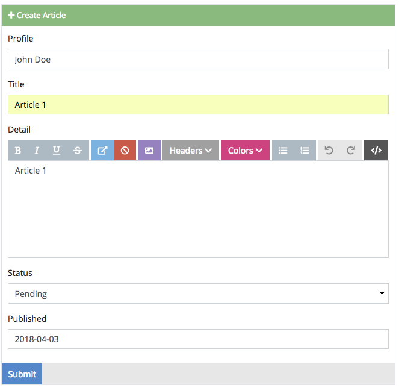
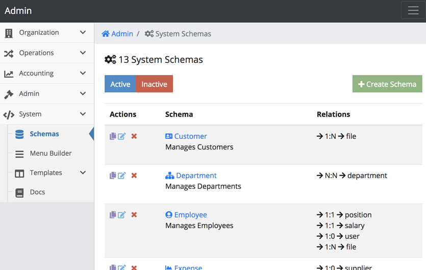
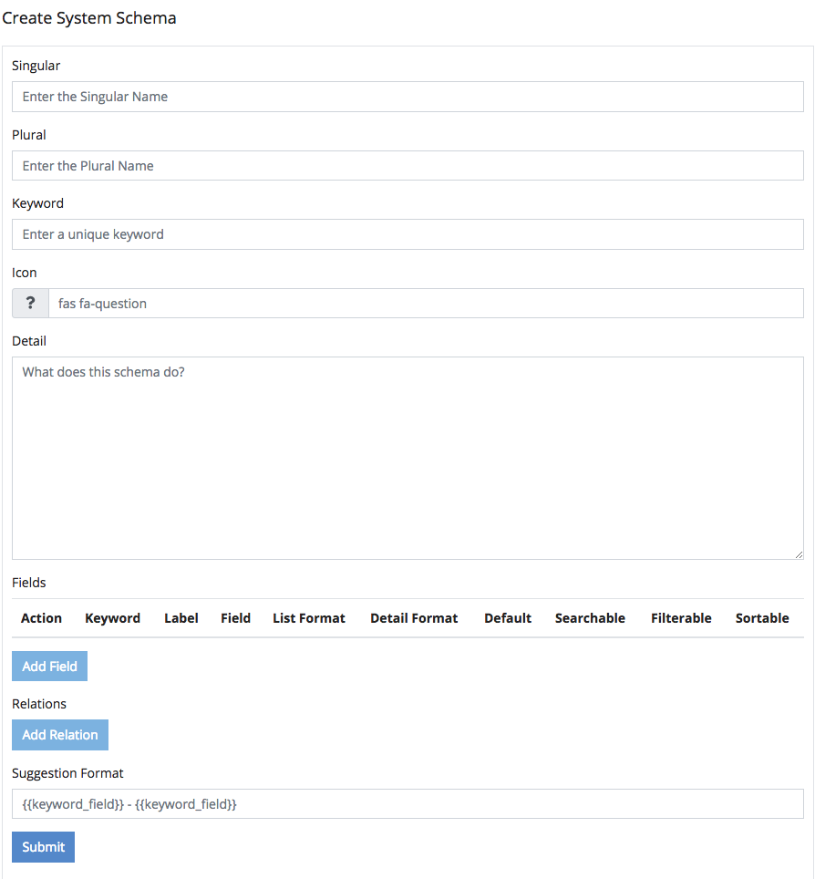
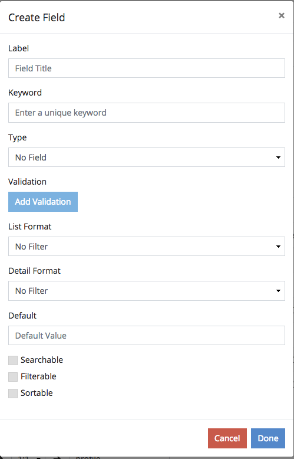
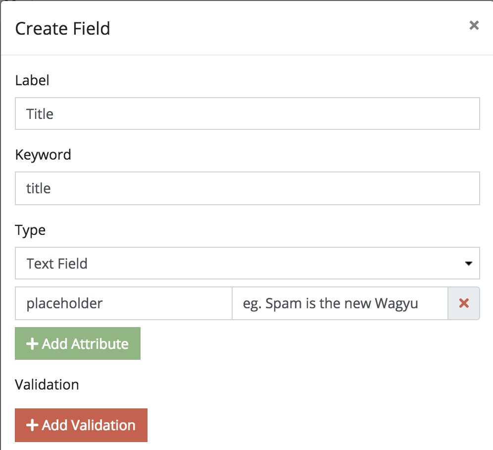
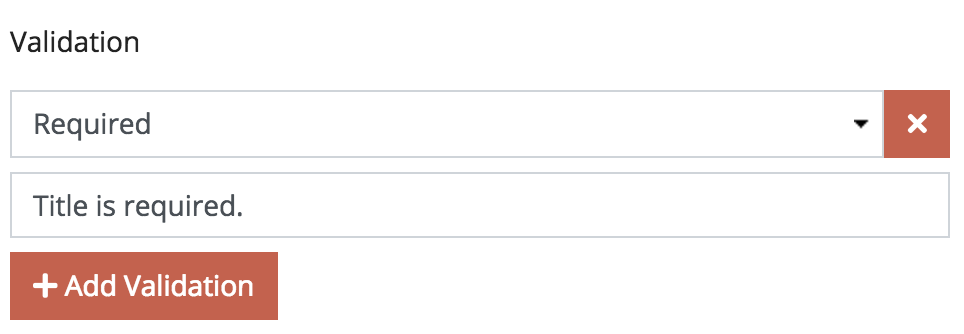
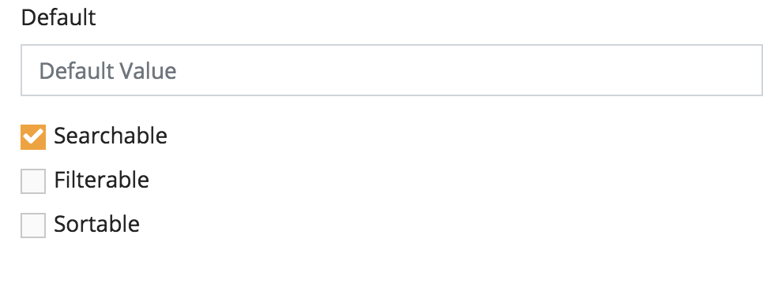
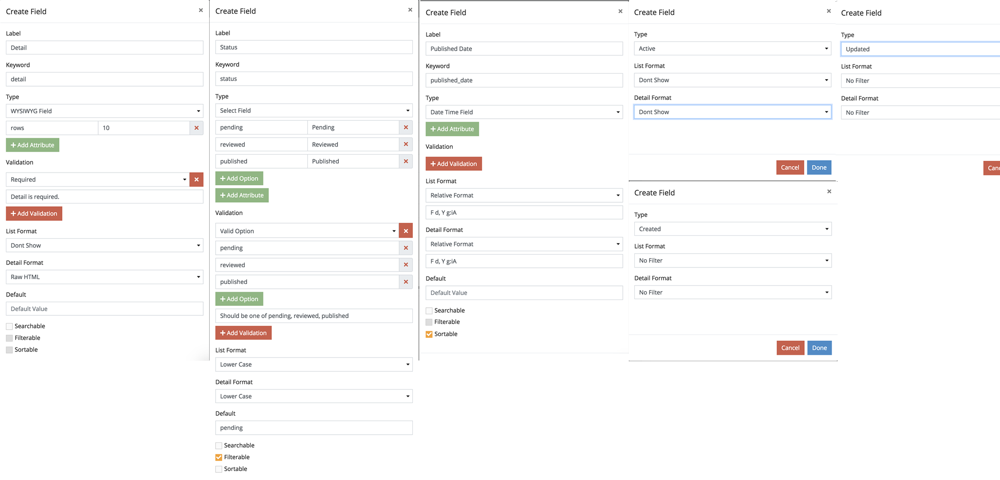
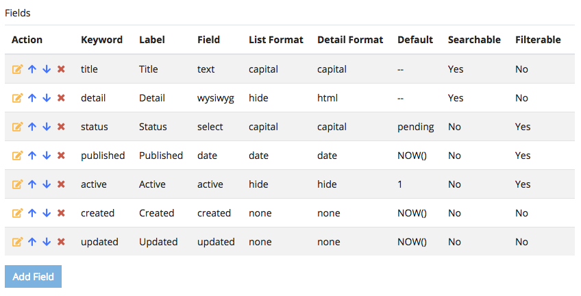

# 2.1. Creating a Schema

 - [2.1.1. Schema Fields](#info)
 - [2.1.2. Custom Fields](#types)
 - [2.1.3. Validation](#validation)
 - [2.1.4. Formats](#formats)
 - [2.1.5. Indexes](#indexes)
 - [2.1.6. Add More Fields](#morefields)
 - [2.1.7. Relations](#relations)
 - [2.1.8. Suggested Format](#suggested)

A schema contains all the information needed to create an object. For example
when we think about an **Article** it could have the following properties.

 - **Title** - Text Field; required
 - **Detail** - Textarea Field; required
 - **Status** - Select Field with the following options:
   - *pending* - Still a work in progress
   - *reviewed* - Draft is complete and reviewed by an editor
   - *published* - Article is now viewable to the public
 - **Published Date** - The date showing when it was first available to the public

We also can determine that an **Article** should have an **Author** *(1:1 relationship)*,
but an **Author** is another kind of schema which we will cover later in this chapter.
If you have worked with articles in other systems, you can already visualize
how the form should like.

###### Figure 2.1.A. Visualizing the Article Form


Let's begin by going to `http://127.0.0.1:8888/admin/system/schema/search`.
You should see something similar to **Figure 2.1.B. Schema Search**. Some schemas
show a lock icon to the left. These are schemas that were generated by a third
party package that is required in order for that package to work. If you wanted
to remove those schemas, you need to remove the associated packages.

### What's installed?

The following is a list of installed packages that defines schemas in the system.
These schemas are also provided in case you would like to add more columns
explicitly. Like the case of the **Profile** schema, you may want to add more
fields like a profile image, email, phone etc.

 - **API** - Used to manage OAuth, REST and web hooks based from schemas and events  
 - **Auth** - Used to manage sign ups and log ins
 - **History** - Used to monitor user activity within the system
 - **Profile** - Used to manage user information
 - **Role** - Used to manage roles and permissions of users

###### Figure 2.1.B. Schema Search


Click the **Create Schema** button on the top right and you should be redirected
to the  **Schema Form** which looks like the image below. The information on
this form is used to determine how objects are created, inputted and displayed
within the admin.

###### Figure 2.1.C. Schema Form


<a name="info"></a>
## 2.1.1. Schema Fields

We will call this the **Article Schema**. The following items describes what
each field in the schema information is and recommendations on what to input.
It's important that the follow the prescribed values for now, as they will be
referenced throughout this and the next few chapters.

 - **Singular** - **required**; This is the name of your object. Since we are going to create
 a schema called article, enter `Article` in that field.
 - **Plural** - **required**; This is the plural name form of the object. We need to know this
 to properly label the search page and instead of computing what the plural form
 for every possible noun in ever language and context, it's better off we
 explicitly tell the system what it is. Enter `Articles` in that field.
 - **Keyword** - **required**; This will be the programatic name of the object. The keyword
 should not have any spaces, dashes, or any special characters besides, letters,
 numbers or an underscore. When you enter the **Singular** field, this field
 automatically got populated with `article` leave that value alone for now.
 - **Group** - *optional*; In newer versions of *Cradle*, this new field was introduced to
 help categorize schemas, which is very helpful when you have tons of schemas
 defined. Enter `Content` in that field.
 - **Icon** - *optional*; If you click that field a drop down of [Font Awesome](https://fontawesome.com/icons)
 icons should appear. Feel free to choose any icon that is suitable to
 represent **Articles**.
 - **Detail** - *optional*; This field is shown on the schema search page so you don't forget
 what this schema does. Enter `Manages articles in the system.` for now.

If you were following this section thoroughly, then your schema form should look
like the following image.

###### Figure 2.1.1.A. Article Schema


```info
INFORMATION: Some images in this documentation maybe cut off for readability.
Try clicking on it to get the full view.
```

<a name="types"></a>
## 2.1.2. Custom Fields

Now that we have our **Article Schema** information populated, let's continue on
to create the fields. We will be creating our first custom field called **Title**.
Look for the green **Add Field** button and click it.

###### Figure 2.1.2.A. Field Form


The following items describes what each field in the **Add Field** form is and
recommendations on what to input. It's important that the follow the prescribed
values are used for now, as they will be referenced throughout this and the next
few chapters.

 - **Label** - **required**; This is the title of a field used on forms. Enter
 `Title` in that field.
 - **Keyword** - **required**; This will be the programatic name of the field. The
 keyword should not have any spaces, dashes, or any special characters besides,
 letters, numbers or an underscore. When you enter the **Label** field, this field
 automatically got populated with `title` leave that value alone for now.
 - **Type** - *optional*; This is a dropdown of possible field types you can
 choose from. We tried to add as many possible fields we can think of and for
 any that was missed, you can define your custom fields as well. You can discover
 more about these types in [2.A. Reference: Field Types](./2.A.-Reference-Field-Types.html).
 For now, choose `Text Field` which is the equivalent to `input[type=text]`.
 This will produce a button called **Add Attributes** click it and on the
 **Attribute** field enter `placeholder` and on the **Value** field enter
 `eg. Spam is the new Wagyu`
 - **Validation** - *optional*; When a user creates an object, these will be used
 to help determine if the system should process the form submitted. More
 information will be covered in [2.1.3. Validation](#validation) below.
 - **List Format** - *optional*; This is used to determine how the value of this
 field should look like on a listing type page *(like a search page)*. More
 information will be covered in [2.1.4. Formats](#formats) below.
 - **Detail Format** - *optional*; Similar to **List Format**. This is used to
 determine how the value of this field should look like on a detail type page
 *(like an article page)*. More information will be covered in
 [2.1.4. Formats](#formats) below.

If you were following this section thoroughly, then your field form should look
like the following image.

###### Figure 2.1.2.B. Title Field


<a name="validation"></a>
## 2.1.3. Validation

Next let's make the **Title** required. Click **Add Validation** and by default
`Required` will be selected. Leave that the way it is and in the **Error Message**
field set the value to `Title is Required`. In the future, when a user enters a
value for this field, and before it is created, the value will be checked against
the validation that you setup herein. You can use a combination of validation
options to suggest the correct kind of input from a user.

###### Figure 2.1.3.A. Title Validation


As you can also tell there are a lot of validation options. You can discover
more about these validations in
[2.B. Reference: Validation Types](./2.B.-Reference-Validation-Types.html).

<a name="formats"></a>
## 2.1.4. Formats

In the **List Format** and **Detail Format** choose `Capitalize`. In both the
**Article Search Page** and **Article Detail Page**, this will transform the
field value of **Title** to capitalize every first letter of every word. Formats
are used to determine how a value should be displayed to the user.

If you create a number field that allows 7 digits, a user can input `9999999`
but reading that could be cryptic without commas *(`9,999,999`)*. Based on this,
we can conclude that the input may not be necessarily what we want as the output.
This is the idea with output formats.

###### Figure 2.1.4.A. Title Formats


In the system, list output formats filters the output in search pages in the
admin and detail output formats filters the output on detail pages in the admin.
You can discover more about these formats in
[2.C. Reference: Format Types](./2.C.-Reference-Format-Types.html).

<a name="indexes"></a>
## 2.1.5. Indexes

For now, set the **Title** to be just `Searchable` and do not check
**Filterable** or **Sortable**. We call these three fields indexes.
The following briefly describes what they are used for.

 - **Searchable** - When a user searches the object rows, this will make the
 values of this field part of its search criteria. Making too many fields
 searchable will make the results vague, so its recommended to use this sparse.
 - **Filterable** - Users can filter the search results by these values. This is
 useful when values are a finite set of values.
 - **Sortable** - Users can sort search results by these values. This is useful
 for number based and date/time based fields.

You can discover more about Indexes in
[2.D. Reference: Indexes & Relations](./2.D.-Reference-Indexes-&-Relations.html).

###### Figure 2.1.5.A. Title Should be Searchable


<a name="morefields"></a>
## 2.1.6. Add More Fields

Continue to add the rest of the fields for the **Article**. Provided below is a
summarized *cheat sheet* of recommended fields that should be added.

###### Figure 2.1.6.A. Article Schema Cheat Sheet


In this sheet, there are three special columns called **Active**, **Created**
and **Updated**. These columns are not actually fields, but placeholders that
perform the following activities.

 - **Active** - Allows **Articles** to be restorable. Without this,
 whenever an **Article** is removed it is gone forever
 - **Created** - This adds a system timestamp whenever an **Article** is created
 - **Updated** - This adds a system timestamp whenever an **Article** is updated

###### Figure 2.1.6.B. Active, Created and Updated


If you added all the fields correctly, your field table found in the schema form
should look like the following image.

###### Figure 2.1.6.C. Article Field Table


<a name="relations"></a>
## 2.1.7. Relations

###### Figure 2.1.7.A. Article Relations


Next click the **Add Relation** button and set the dropdown to `1:1` and the
field value to `profile`. This will setup a required one-to-one *(1:1)*
relationship with **profile** which will act as our **Author Schema** in this case.
In other words, *"an **Article** should have an **Author**"*. You can discover more
about Relations in [2.3. Working with Relations](./2.3.-Working-With-Relations.html).

<a name="suggested"></a>
## 2.1.8. Suggested Format

The last step is to set the **Suggested Format** to
`{{article_title}}`. Suggested formats are used when other
schemas declares a relationship with article. You can discover more
about Suggestions as well in [2.3. Working with Relations](./2.3.-Working-With-Relations.html).

<a name="conclusion"></a>
## 2.1.9. Conclusion

> The best code ever written, is the one you never had to write.
*-- Steve Jobs*

That is the basic gist to build a schema in Cradle. This saves a lot of time
versus getting your back end custom made. The purpose of this is to have your
developers move on to the advance things while the basics are taken care of. In
the next section [2.2. Populating Models](./2.2.-Populating-Models.html), we
will go over how to add new articles and manage its entries.
