# 2.5. Roles & Permissions

 - [2.5.1. Creating a New Admin](#create_admin)
 - [2.5.2. Managing Permissions](#permissions)
 - [2.5.3. Testing With Jane Doe](#testing)

In the last chapter [2.4. Adding Menu Items](./2.4.-Adding-Menu-Items.html),
brought up some questions about how to work with roles and permissions. In this
chapter, we will understand how these role work within the system.

<a name="create_admin"></a>
## 2.5.1. Creating a New Admin

Before we play with roles, we should make a new user to make sure we don't mess
up our current account. Let's first go to
`http://127.0.0.1/admin/system/model/profile/search`. You can also use the admin
navigation to the left by opening the **Admin** menu drop down and selecting
`Profile`. From there, click the `Create Profile` on the top right.

###### Figure 2.5.1.A. Creating a User
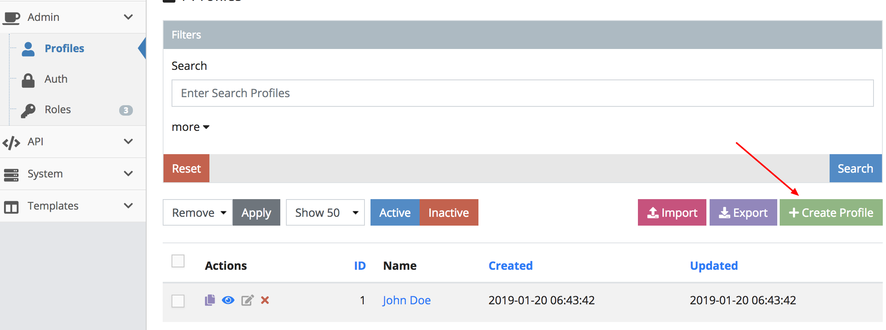

As you can see there is only one field that needs to be filled out. Let's name
our first profile `Jane Doe` and submit.

In the system, users are separated by two objects, **Profile** and **Authentication**.
This is because we should separate user data to the ones that could be publicly
available data in such as name, image, gender going to  **Profile** and sensitive
information like email, phone, password going to **Auth**. We don't want to
accidentally leak out the **Auth** table.

###### Figure 2.5.1.B. Hello Jane Doe
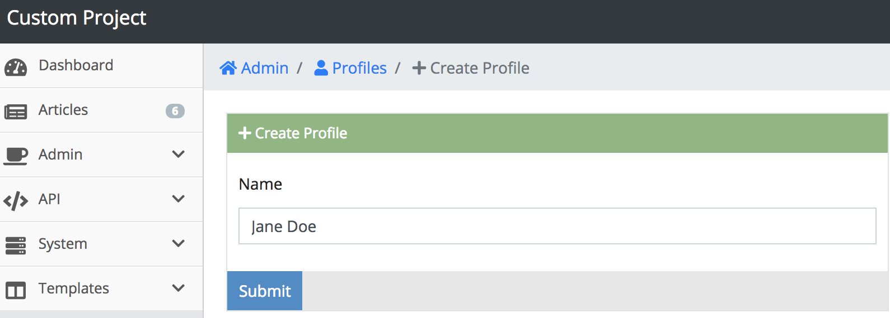

The next thing to do is go to `http://127.0.0.1/admin/system/model/auth/search`.
You can also use the admin navigation to the left by opening the **Admin** menu
drop down and selecting `Auth`.

###### Figure 2.5.1.C. Navigating to Auth
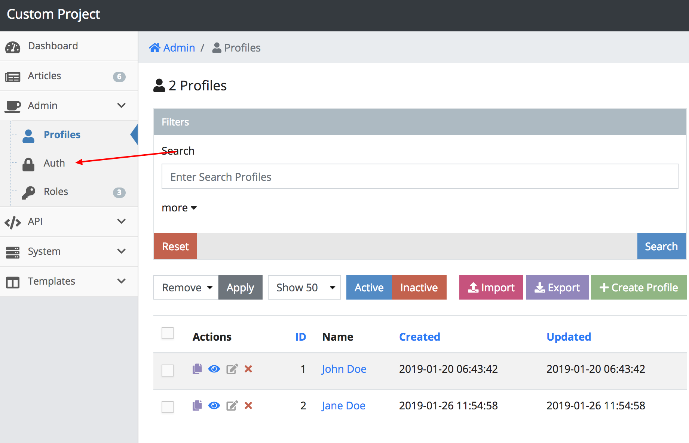

Click the `Create Authentication` on the top right.

###### Figure 2.5.1.D. Creating an Authentication
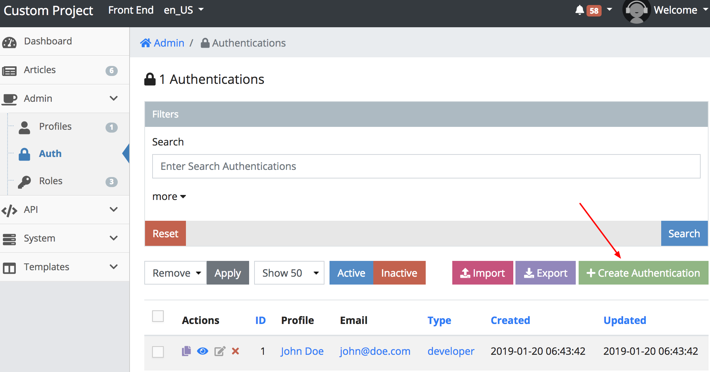

The following items outline what these fields are and what to enter.

 - **Profile** - The profile entry; "an **Auth** should have a **Profile**";
 Enter `Jane Doe`
 - **Email** - This is the log in info; Enter `jane@doe.com`
 - **Password** - This is the log in password; Enter `123`
 - **Type** - This is the role that will be assigned; Enter `admin`

If you entered the fields correctly it should look like the image below. Go
ahead and submit the form.

###### Figure 2.5.1.E. Jane's Authentication
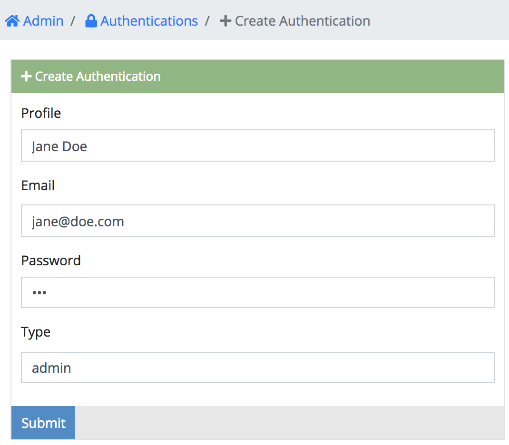

The next thing to do is go to `http://127.0.0.1/admin/system/model/role/search`.
You can also use the admin navigation to the left by opening the **Admin** menu
drop down and selecting `Role`.

###### Figure 2.5.1.F. Navigating to Roles
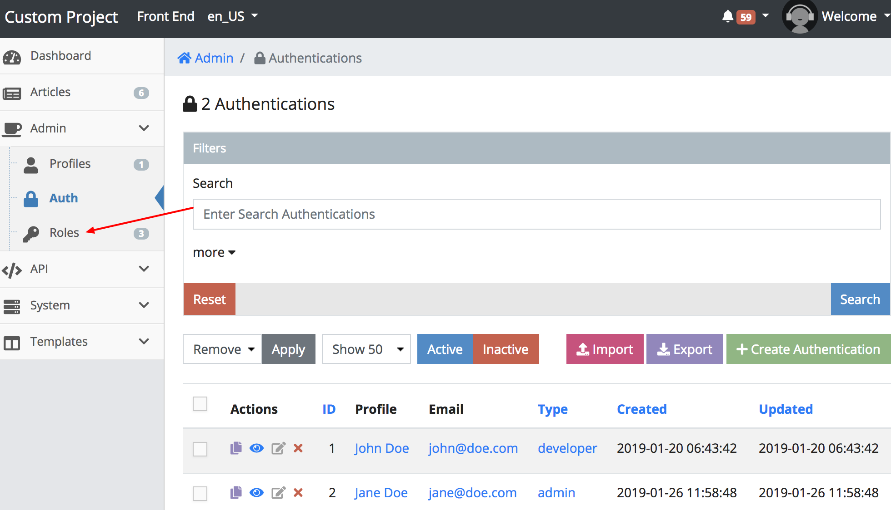

<a name="permissions"></a>
## 2.5.2. Managing Permissions

The system comes with three predefined roles that shouldn't be removed. The
following items outlines these roles.

 - `developer` - Used for developers making schemas, server ops screens and
 setting up the admin
 - `admin` - Used for administration in charge of populating and managing the
 admin.
 - `guest` - By default all users *(even logged off)* get this role. This only
 allows front end access.

```warning
Changing developer permissions could lock you out of the admin.
```

This time we are going to be managing the `admin` role. Find the row actions for
`admin` and click the grey update action.

###### Figure 2.5.2.A. Update Admin Role
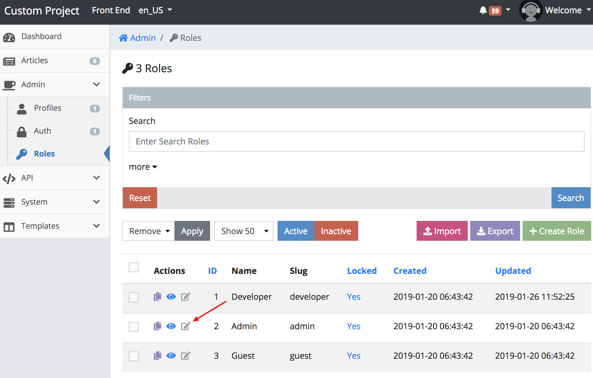

Next scroll down and look for a section called `Permissions`.

```info
INFO: The system initially takes a security stance of "need to have permissions"
to access anything. This means the following permissions is a white list of URLs
that can be accessed.
```

Click `Add Permission` and it will create a fieldset that shows three horizontal
fields that are described by the following items below.

 - **Label** - The name of the Permission
 - **Method** - This is the HTTP method that will be compared where:
   - `GET` - is a general page load
   - `POST` - is when submitting a form or is creation of an object *(usually for API calls)*
   - `PUT` - is updating an object *(usually for API calls)*
   - `DELETE` - is removing an object *(usually for API calls)*
   - `ALL` - any method is accepted
 - **Path** - the URL path that is accepted to access. This also accepts
 [Regular Expressions](https://www.regular-expressions.info) and Star Variables.

###### Figure 2.5.2.B. Add a Permission
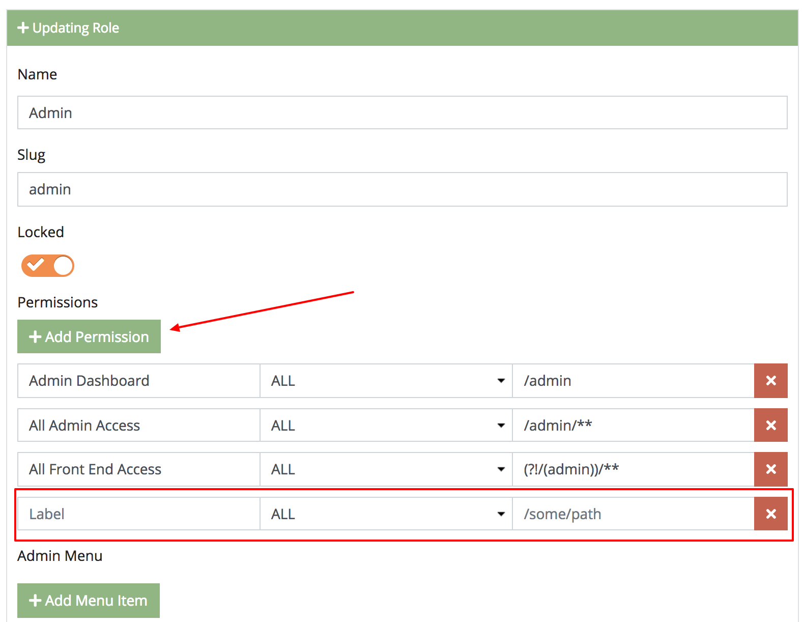

Lets remove `All Admin Access` and add two rows.

 - Permission 1
   - **Label** - Enter `Admin Articles`
   - **Method** - Set to `All`
   - **Path** - Enter `/admin/system/model/article/**`
 - Permission 2
   - **Label** - Enter `Admin Comments`
   - **Method** - Set to `All`
   - **Path** - Enter `/admin/system/model/comment/**`

If you entered the fields correctly it should look like the image below.

###### Figure 2.5.2.C. Allowing Articles and Comments
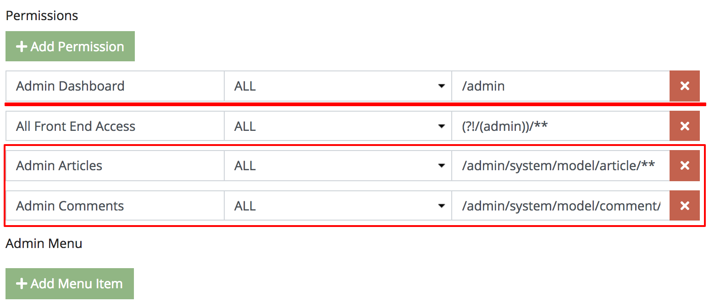

So permission paths can be represented by an explicit path like
`/admin/system/model/article/search` and using
[Regular Expressions](https://www.regular-expressions.info). The following
describes how to use star variables in your permission path.

### 2.5.2.1. Star Variable

As you can tell, paths can also be expressed with wildcards by adding a `*` as
in `/some/*/stuff`. When the URL is `/some/good/stuff`, the above path will be
matched, like wise with `/some/bad/stuff`, however `/some/stuff` will not match
the above path.

### 2.5.2.2. Double Star Variable

To take on an *N* amount of wildcards you can add `**` as in `/some/**/stuff`.
When the URL is `/some/good/stuff`, the path will be
matched, like wise with `/some/even/better/stuff`, however `/some/stuff` will
not match the above path.

If you wanted a path to match all `/article` URLs for example, you can do so
with `/article/**` or even `**`.

----

Lastly, Let's populate the menu item with the following values outlined.

 - **Icon Field** - Choose any icon.
 - **Menu Title** - Enter **Articles**
 - **Menu URL Link** - Enter `/admin/system/model/article/search`

Also re-order the **Articles** menu item so it shows right below the
**Dashboard** menu item so it looks like the image below. When your done, go
ahead and submit the form.

###### Figure 2.5.2.D. Add an Article Menu


<a name="testing"></a>
## 2.5.3. Testing With Jane Doe

Now that we are done with creating a user and setting its role, let's try
logging in with `Jane Doe` to see the permissions at work. First we need to log
off. This is found at the top right of the admin under the `Welcome` drop down.
Alternatively you can go to `http://127.0.0.1/auth/logout`.

Next go to `http://127.0.0.1/auth/login` and enter the following credentials.

 - **Email** - This is the log in info; Enter `jane@doe.com`
 - **Password** - This is the log in password; Enter `123`

###### Figure 2.5.3.A. Log In
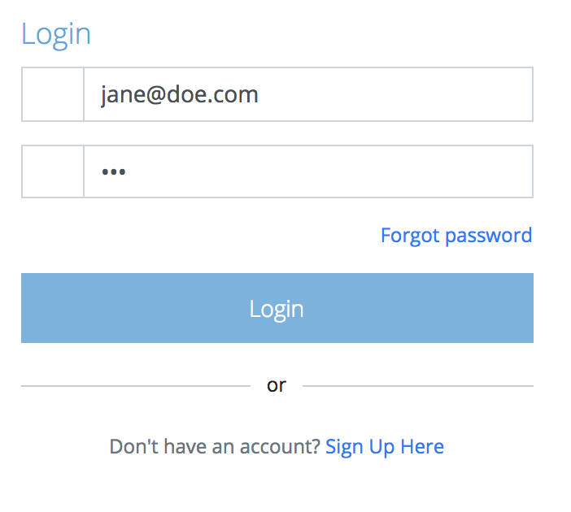

After you log in, go to `http://127.0.0.1/admin`. If you try to click through
some of the menu items like **Profile**, **Auth** and **Role** it will not let
you access these links, however the system will allow you to access the **Articles**
link with no issues.

###### Figure 2.5.3.B. Final Results
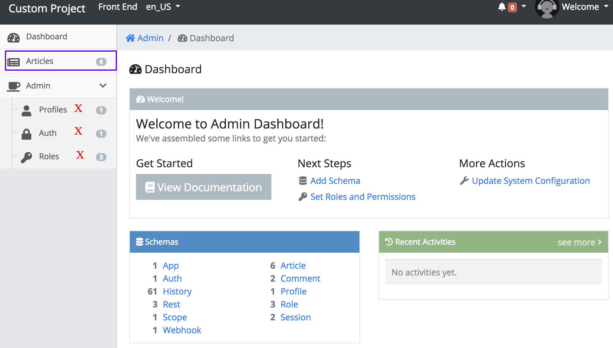

<a name="conclusion"></a>
## 2.5.4. Conclusion

We just completed creating an admin user in the system and properly setting up
the role. In the next chapter [2.6. Creating a Fieldset](./2.6.-Creating-a-Fieldset.html)
we will be re-entering schema land and working with fieldsets in depth.
