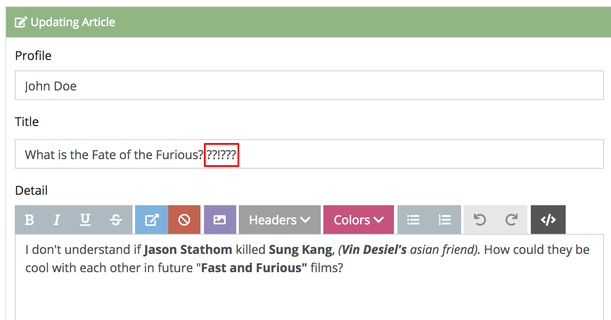
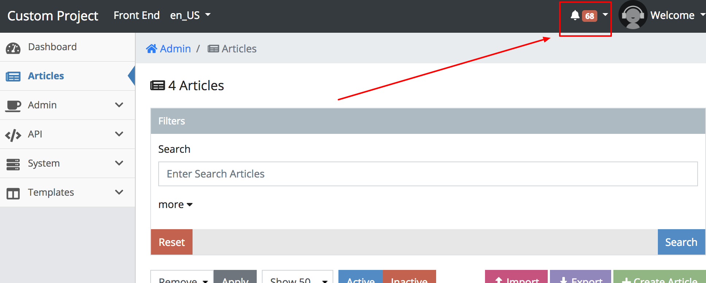
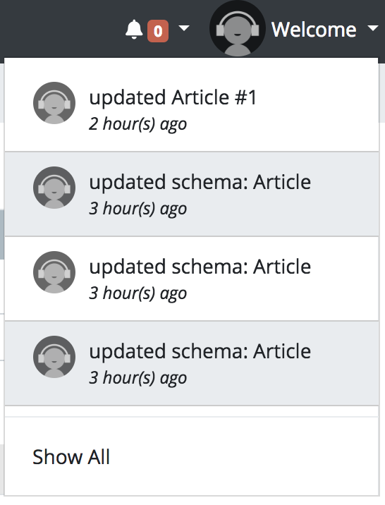
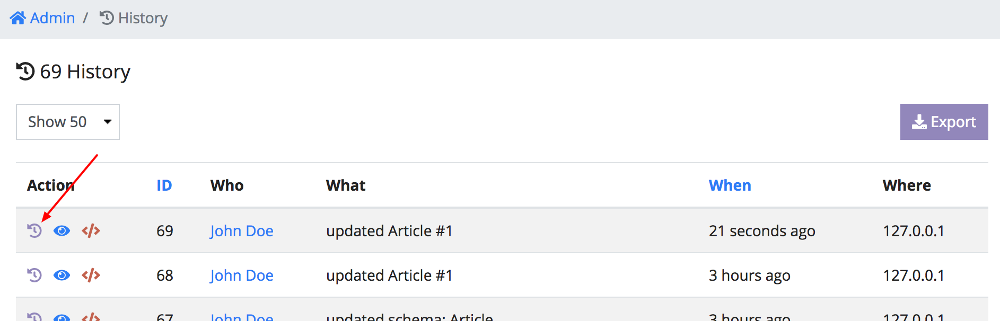
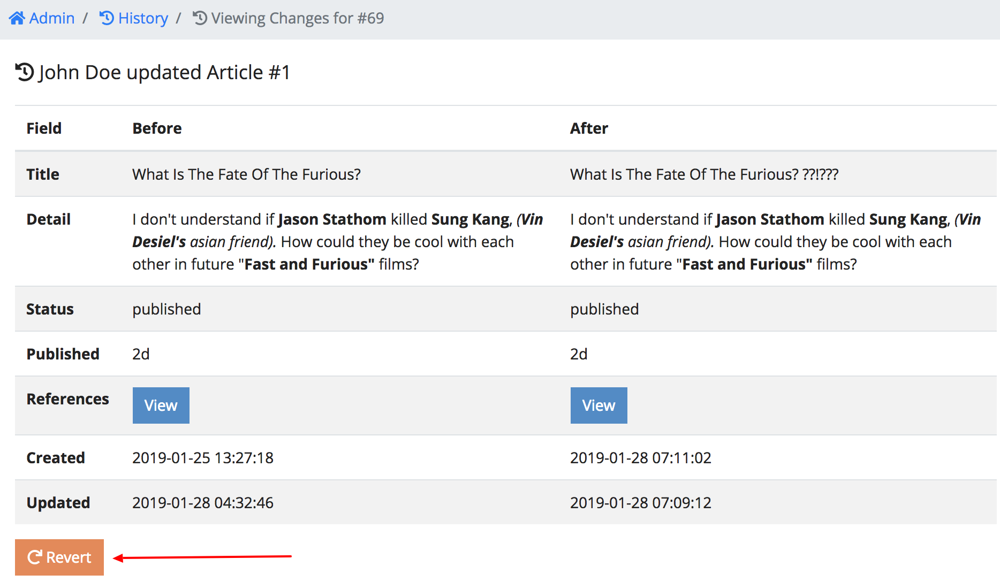

# 2.7. Monitoring Changes

Let's make a noticeable change in one of the **Articles** like the image below
add on to the title.

###### Figure 2.7.A. Making an Article Change


After saving the **Article** On the top right you will notice on the top right
of admin there's a bell icon that just incremented by one *(in the red indicator)*.
Click it to open a list of the last 5 recent changes.

###### Figure 2.7.B. Notifications


Towards the bottom of that list you should see a call to action called `Show All`.
Clicking this will direct you to the **History** search page.

###### Figure 2.7.C. Notification Drop Down


For ease of understanding, the history is uses a simplified
*Who, What, When, Where* table, where the rows have special row actions that we
have never seen before. Going from left-to-right, the following items describes
each action.

 - **View Changes** - *purple replay icon* - Clicking this will show you the
 data of the item with the data of what is previously was before the update
 happened.
 - **View Item** - *blue eye icon* - Clicking this will redirect you directly to
 the item that was changed.
 - **View Log** - *red code icon* - Clicking this will bring you to the raw logs
 that were captured during this event.

```warning
WARNING: Please make sure the `/logs` folder in your project is writable
```

Let's click on **View Changes** *(purple replay icon)* to see our latest change.

###### Figure 2.7.D. View Changes


As you can see, the system includes a way to revert the changes incase there was
some sort of mistake.

###### Figure 2.7.E. Revert Changes


```info
You've unlocked a secret! Visit http://127.0.0.1:8888/admin/history/changes/article/1 to
see a full list of changes.
```

<a name="conclusion"></a>
## Conclusion

History mixed with roles adds accountability to users of the system and allows to
somewhat recover data. Adding on to the capabilities of this admin, in the next
chapter [2.8. Setting up the API](./2.8.-Setting-up-the-API.html), we will be
covering how Cradle can programmatically communicate with other systems.
