# 2.A. Reference: Schema Field Types

 - [2.A.1. Text Field](#text)
 - [2.A.2. Email Field](#email)
 - [2.A.3. Password Field](#password)
 - [2.A.4. Search Field](#search)
 - [2.A.5. URL Field](#url)
 - [2.A.6. Color Field](#color)
 - [2.A.7. Mask Field](#mask)
 - [2.A.8. Slug Field](#slug)
 - [2.A.9. Textarea Field](#textarea)
 - [2.A.10. WYSIWYG Field](#wysiwyg)
 - [2.A.11. Markdown Field](#markdown)
 - [2.A.12. Number Field](#number)
 - [2.A.13. Small Number Field](#small)
 - [2.A.14. Range Field](#range)
 - [2.A.15. Float Field](#float)
 - [2.A.16. Price Field](#price)
 - [2.A.17. Date Field](#date)
 - [2.A.18. Time Field](#time)
 - [2.A.19. Date Time Field](#datetime)
 - [2.A.20. Week Field](#week)
 - [2.A.21. Month Field](#month)
 - [2.A.22. Checkbox Field](#checkbox)
 - [2.A.23. Switch Field](#switch)
 - [2.A.24. Select Field](#select)
 - [2.A.25. Checkboxes Field](#checkboxes)
 - [2.A.26. Radio Field](#radio)
 - [2.A.27. File Field](#file)
 - [2.A.28. Image Field](#image)
 - [2.A.29. Files Field](#files)
 - [2.A.30. Images Field](#images)
 - [2.A.31. Tag Field](#tag)
 - [2.A.32. Meta Field](#meta)
 - [2.A.33. Multi Range Field](#multirange)
 - [2.A.34. Unique ID Field](#unique)
 - [2.A.35. Active Field](#active)
 - [2.A.36. Created Field](#created)
 - [2.A.37. Updated Field](#updated)

The following is the documentation for field types you can choose from when
creating a schema with Cradle. The fields are a mixture of HTML5 fields as well
as advanced fields commonly used around the web.

## 2.A.1. Text Field

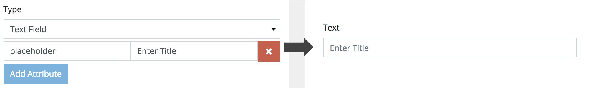

### Attributes

autocomplete | on, off | Specifies whether the field should have autocomplete enabled
autofocus | autofocus | Specifies that the field should automatically get focus when the page loads
pattern | regexp | Specifies a regular expression that the field value is checked against
placeholder | text | Specifies a short hint that describes the expected value of the field
required | required | Specifies that the field must be filled out before submitting the form

## 2.A.2. Email Field

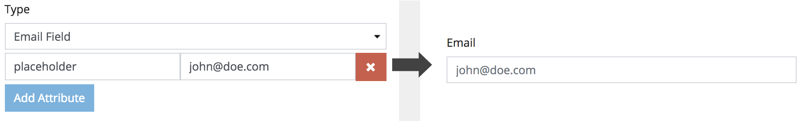

### Attributes

autocomplete | on, off | Specifies whether the field should have autocomplete enabled
autofocus | autofocus | Specifies that the field should automatically get focus when the page loads
placeholder | text | Specifies a short hint that describes the expected value of the field
required | required | Specifies that the field must be filled out before submitting the form

## 2.A.3. Password Field

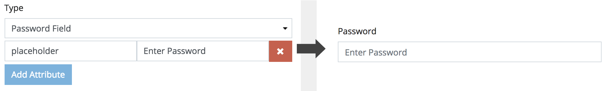

### Attributes

autocomplete | on, off | Specifies whether the field should have autocomplete enabled
autofocus | autofocus | Specifies that the field should automatically get focus when the page loads
placeholder | text | Specifies a short hint that describes the expected value of the field
required | required | Specifies that the field must be filled out before submitting the form

## 2.A.4. Search Field

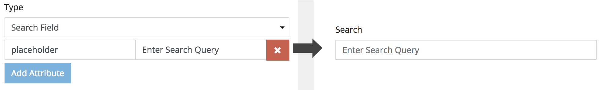

### Attributes

autocomplete | on, off | Specifies whether the field should have autocomplete enabled
autofocus | autofocus | Specifies that the field should automatically get focus when the page loads
placeholder | text | Specifies a short hint that describes the expected value of the field
required | required | Specifies that the field must be filled out before submitting the form

## 2.A.5. URL Field

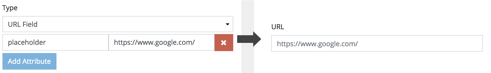

### Attributes

autocomplete | on, off | Specifies whether the field should have autocomplete enabled
autofocus | autofocus | Specifies that the field should automatically get focus when the page loads
placeholder | text | Specifies a short hint that describes the expected value of the field
required | required | Specifies that the field must be filled out before submitting the form

## 2.A.6. Color Field

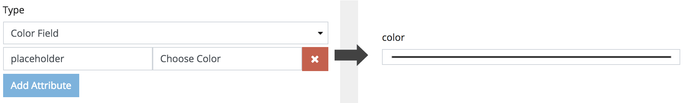

### Attributes

autocomplete | on, off | Specifies whether the field should have autocomplete enabled
autofocus | autofocus | Specifies that the field should automatically get focus when the page loads
placeholder | text | Specifies a short hint that describes the expected value of the field
required | required | Specifies that the field must be filled out before submitting the form

## 2.A.7. Mask Field

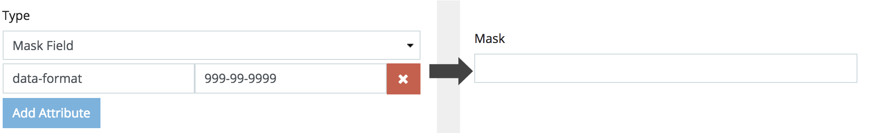

### Attributes

autocomplete | on, off | Specifies whether the field should have autocomplete enabled
autofocus | autofocus | Specifies that the field should automatically get focus when the page loads
pattern | regexp | Specifies a regular expression that the field value is checked against
placeholder | text | Specifies a short hint that describes the expected value of the field
required | required | Specifies that the field must be filled out before submitting the form
data-format | string | Input field value format

### Format

 - `9` : numeric
 - `a` : alphabetical
 - `*` : alphanumeric`

It is possible to define some parts in the mask as optional. This is done by
using `[]` as in `(99) 9999[9]-9999`.

The above example will allow values like `(99) 99999-9999` or `(99) 9999-9999`.
Dynamic masks can change during the input. To define a dynamic part use `{}`.

 - `{n}` => n repeats
 - `{n|j}` => n repeats, with j jitmasking
 - `{n,m}` => from n to m repeats
 - `{n,m|j}` => from n to m repeats, with j jitmasking

Also `{+}` and `{*}` is allowed. `+` start from 1 and `*` start from 0.

## 2.A.8. Slug Field

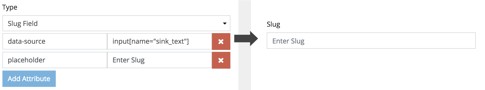

### Attributes

autocomplete | on, off | Specifies whether the field should have autocomplete enabled
autofocus | autofocus | Specifies that the field should automatically get focus when the page loads
pattern | regexp | Specifies a regular expression that the field value is checked against
placeholder | text | Specifies a short hint that describes the expected value of the field
required | required | Specifies that the field must be filled out before submitting the form
data-source | selector | The CSS selector to which to based the value from

## 2.A.9. Textarea Field

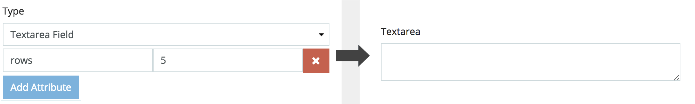

### Attributes

autofocus | autofocus | Specifies that the field should automatically get focus when the page loads
cols | number | Specifies the visible width of a text area
maxlength | number | Specifies the maximum number of characters allowed in the text area
placeholder | text | Specifies a short hint that describes the expected value of the field
required | required | Specifies that the field must be filled out before submitting the form
rows | number | Specifies the visible number of lines in a text area
wrap | hard, soft | Specifies how the text in a text area is to be wrapped when submitted in a form

## 2.A.10. WYSIWYG Field

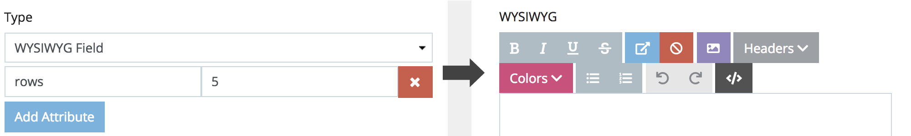

### Attributes

cols | number | Specifies the visible width of a text area
maxlength | number | Specifies the maximum number of characters allowed in the text area
placeholder | text | Specifies a short hint that describes the expected value of the field
required | required | Specifies that the field must be filled out before submitting the form
rows | number | Specifies the visible number of lines in a text area

## 2.A.11. Markdown Field

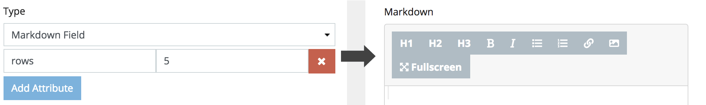

### Attributes

placeholder | text | Specifies a short hint that describes the expected value of the field
required | required | Specifies that the field must be filled out before submitting the form
data-height | number | height size of the editor
data-width | number | width size of the editor

## 2.A.12. Number Field

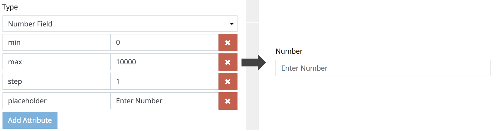

### Attributes

autocomplete | on, off | Specifies whether the field should have autocomplete enabled
autofocus | autofocus | Specifies that the field should automatically get focus when the page loads
placeholder | text | Specifies a short hint that describes the expected value of the field
required | required | Specifies that the field must be filled out before submitting the form
max | number | Specifies the maximum value for the field
min | number | Specifies a minimum value for the field
step | number | Specifies the legal number intervals for an input field

## 2.A.13. Small Number Field

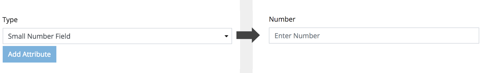

### Attributes

autocomplete | on, off | Specifies whether the field should have autocomplete enabled
autofocus | autofocus | Specifies that the field should automatically get focus when the page loads
placeholder | text | Specifies a short hint that describes the expected value of the field
required | required | Specifies that the field must be filled out before submitting the form

## 2.A.14. Range Field

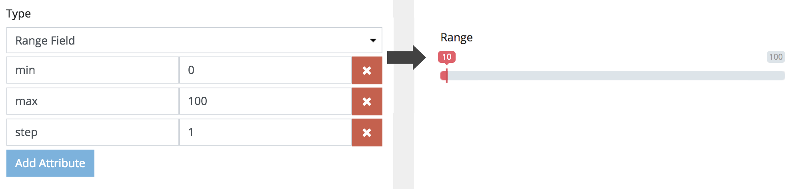

### Attributes

placeholder | text | Specifies a short hint that describes the expected value of the field
required | required | Specifies that the field must be filled out before submitting the form
max | number | Specifies the maximum value for the field
min | number | Specifies a minimum value for the field
step | number | Specifies the legal number intervals for an input field

## 2.A.15. Float Field

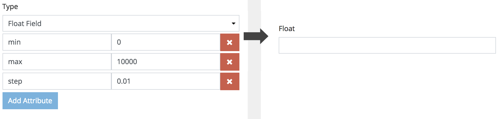

### Attributes

autocomplete | on, off | Specifies whether the field should have autocomplete enabled
autofocus | autofocus | Specifies that the field should automatically get focus when the page loads
placeholder | text | Specifies a short hint that describes the expected value of the field
required | required | Specifies that the field must be filled out before submitting the form
max | number | Specifies the maximum value for the field
min | number | Specifies a minimum value for the field
step | number | Specifies the legal number intervals for an input field

## 2.A.16. Price Field

### Attributes

autocomplete | on, off | Specifies whether the field should have autocomplete enabled
autofocus | autofocus | Specifies that the field should automatically get focus when the page loads
placeholder | text | Specifies a short hint that describes the expected value of the field
required | required | Specifies that the field must be filled out before submitting the form
max | number | Specifies the maximum value for the field
min | number | Specifies a minimum value for the field

## 2.A.17. Date Field

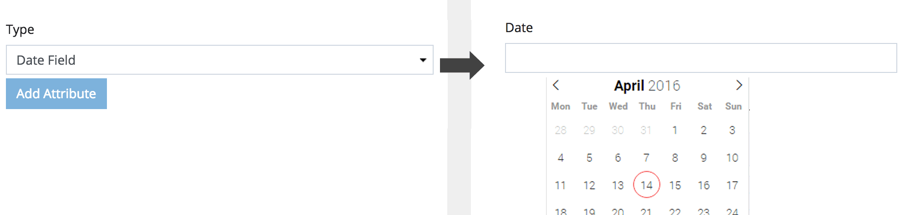

### Attributes

autocomplete | on, off | Specifies whether the field should have autocomplete enabled
autofocus | autofocus | Specifies that the field should automatically get focus when the page loads
placeholder | text | Specifies a short hint that describes the expected value of the field
required | required | Specifies that the field must be filled out before submitting the form
max | date | Specifies the maximum value for the field
min | date | Specifies a minimum value for the field

## 2.A.18. Time Field

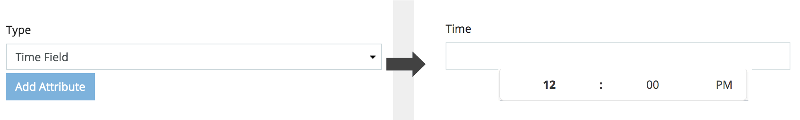

### Attributes

autocomplete | on, off | Specifies whether the field should have autocomplete enabled
autofocus | autofocus | Specifies that the field should automatically get focus when the page loads
placeholder | text | Specifies a short hint that describes the expected value of the field
required | required | Specifies that the field must be filled out before submitting the form

## 2.A.19. Date Time Field

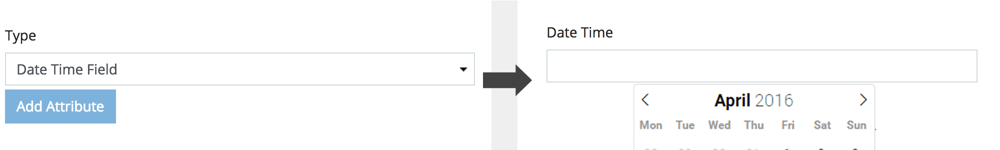

### Attributes

autocomplete | on, off | Specifies whether the field should have autocomplete enabled
autofocus | autofocus | Specifies that the field should automatically get focus when the page loads
placeholder | text | Specifies a short hint that describes the expected value of the field
required | required | Specifies that the field must be filled out before submitting the form
max | date | Specifies the maximum value for the field
min | date | Specifies a minimum value for the field

## 2.A.20. Week Field

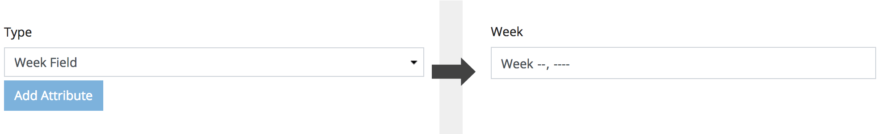

### Attributes

autocomplete | on, off | Specifies whether the field should have autocomplete enabled
autofocus | autofocus | Specifies that the field should automatically get focus when the page loads
placeholder | text | Specifies a short hint that describes the expected value of the field
required | required | Specifies that the field must be filled out before submitting the form

## 2.A.21. Month Field

### Attributes

autocomplete | on, off | Specifies whether the field should have autocomplete enabled
autofocus | autofocus | Specifies that the field should automatically get focus when the page loads
placeholder | text | Specifies a short hint that describes the expected value of the field
required | required | Specifies that the field must be filled out before submitting the form

## 2.A.22. Checkbox Field

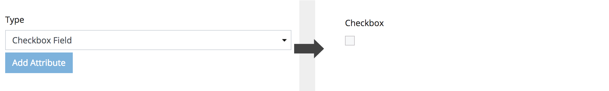

### Attributes

autofocus | autofocus | Specifies that the field should automatically get focus when the page loads
placeholder | text | Specifies a short hint that describes the expected value of the field
required | required | Specifies that the field must be filled out before submitting the form
checked | checked | Specifies that the field should be pre-selected when the page loads

## 2.A.23. Switch Field

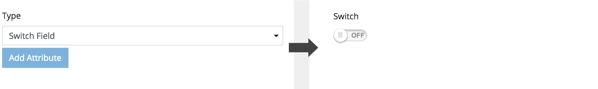

### Attributes

autofocus | autofocus | Specifies that the field should automatically get focus when the page loads
placeholder | text | Specifies a short hint that describes the expected value of the field
required | required | Specifies that the field must be filled out before submitting the form
checked | checked | Specifies that the field should be pre-selected when the page loads

## 2.A.24. Select Field

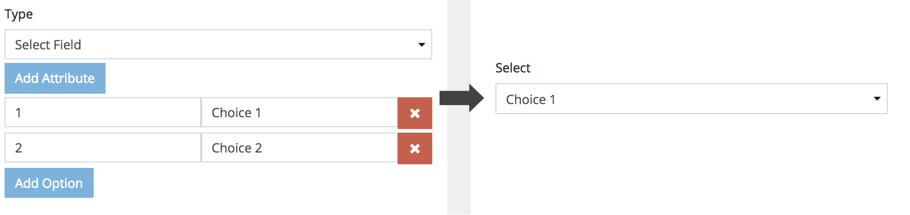

### Attributes

autofocus | autofocus | Specifies that the field should automatically get focus when the page loads
required | required | Specifies that the field must be filled out before submitting the form
size | number | Defines the number of visible options in a drop-down list

## 2.A.25. Checkboxes Field

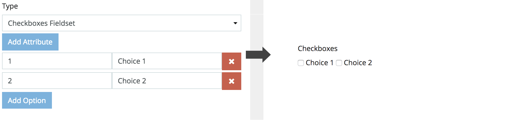

## 2.A.26. Radio Field

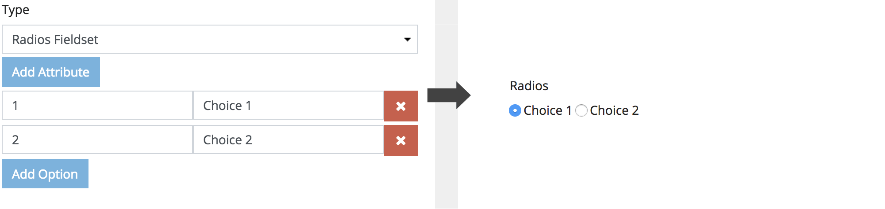

## 2.A.27. File Field

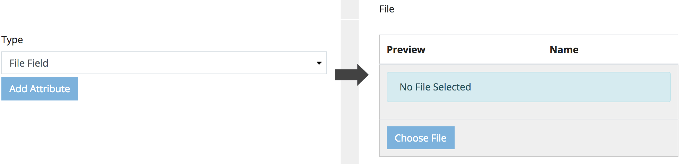

### Attributes

data-accept | string | Comma separated mime types
data-class | string | Class names to add to the field wrapper
data-width | number | Cropping width applied to images
data-height | number | Cropping height applied to images

## 2.A.28. Image Field

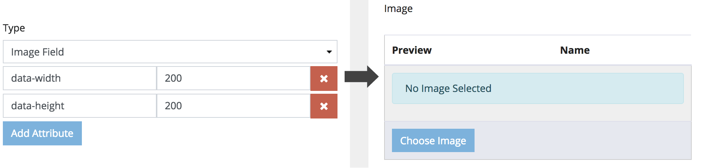

### Attributes

data-accept | string | Comma separated mime types
data-class | string | Class names to add to the field wrapper
data-width | number | Cropping width applied to images
data-height | number | Cropping height applied to images

## 2.A.29. Files Field

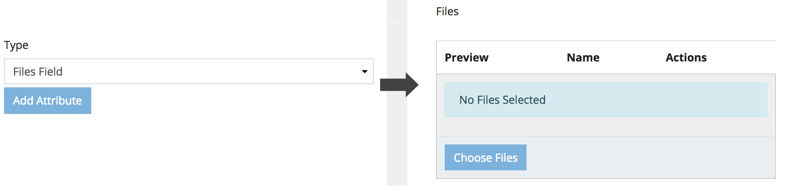

### Attributes

data-accept | string | Comma separated mime types
data-class | string | Class names to add to the field wrapper
data-width | number | Cropping width applied to images
data-height | number | Cropping height applied to images

## 2.A.30. Images Field

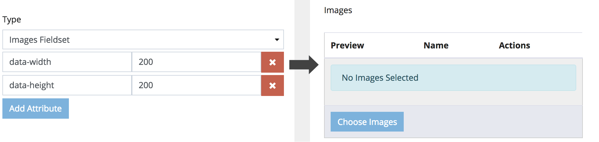

### Attributes

data-accept | string | Comma separated mime types
data-class | string | Class names to add to the field wrapper
data-width | number | Cropping width applied to images
data-height | number | Cropping height applied to images

## 2.A.31. Tag Field

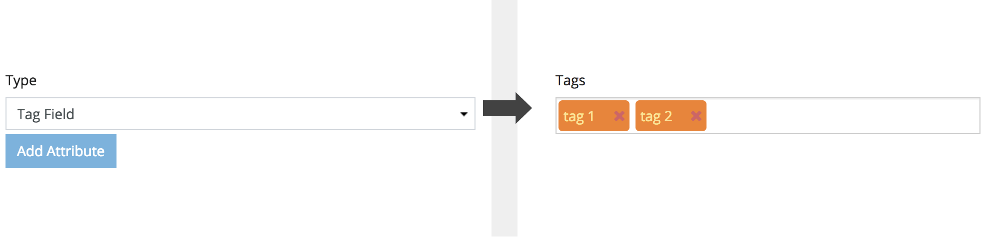

## 2.A.32. Meta Field

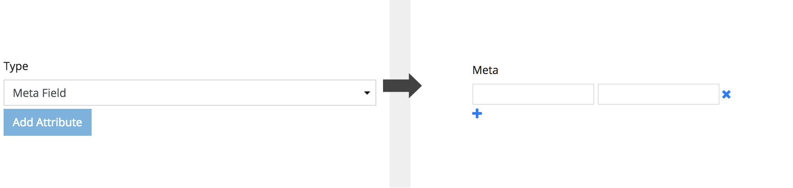

## 2.A.33. Multi Range Field

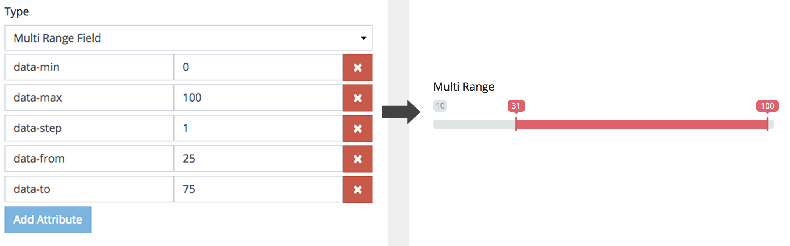

### Attributes

required | required | Specifies that the field must be filled out before submitting the form
data-max | number | Specifies the maximum value for the field
data-min | number | Specifies a minimum value for the field
data-step | number | Specifies the legal number intervals for an input field
data-from | number | Set start position for left handle (or for single handle)
data-to | number | Set start position for right handle

## 2.A.34. Unique ID Field

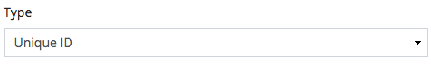

## 2.A.35. Active Field

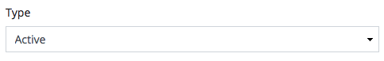

## 2.A.36. Created Field

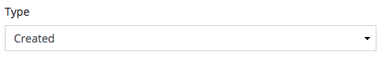

## 2.A.37. Updated Field

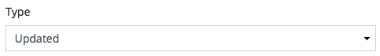
