# 2.B. Reference: Schema Validation Types

 - [2.B.1. Required](#required)
 - [2.B.2. Not Empty](#empty)
 - [2.B.3. Not Equal](#ne)
 - [2.B.4. Valid Option](#option)
 - [2.B.5. Characters Less Than](#clt)
 - [2.B.6. Characters Less Than Equal](#clte)
 - [2.B.7. Characters Greater Than](#cgt)
 - [2.B.8. Characters Greater Than Equal](#cgte)
 - [2.B.9. Words Less Than](#wlt)
 - [2.B.10. Words Less Than Equal](#wlte)
 - [2.B.11. Words Greater Than](#wgt)
 - [2.B.12. Words Greater Than Equal](#wgte)
 - [2.B.13. Valid Number](#number)
 - [2.B.14. Valid Float](#float)
 - [2.B.15. Valid Price](#price)
 - [2.B.16. Less Than](#lt)
 - [2.B.17. Less Than Equal](#lte)
 - [2.B.18. Greater Than](#gt)
 - [2.B.19. Greater Than Equal](#gte)
 - [2.B.20. Valid Date](#date)
 - [2.B.21. Valid Time](#time)
 - [2.B.22. Valid Date Time](#datetime)
 - [2.B.23. Valid Email](#email)
 - [2.B.24. Valid Credit Card](#cc)
 - [2.B.25. Valid Expression](#expression)

Validation occurs when a user submits a form generated by a schema.

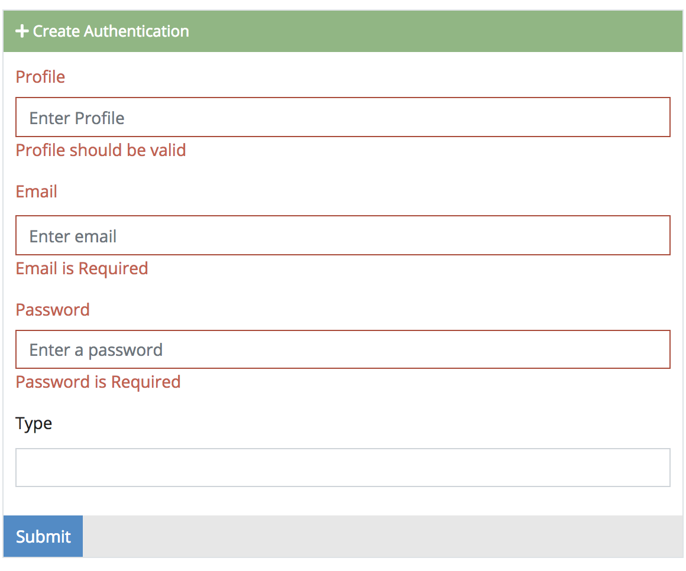

Cradle provides the all kinds of of validation methods. If you
can't find the validation you need, you can create custom validations with a
[Validation Expression](#expression).

## 2.B.1. Required

Requires the field to have a value.

## 2.B.2. Not Empty

If there is a value set, it cannot be empty.

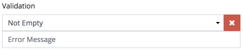

## 2.B.3. Not Equal

Explicitly the field should not equal to the given value.

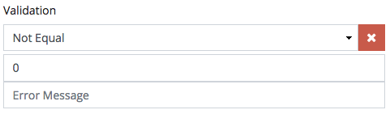

## 2.B.4. Valid Option

The field value should be one of these options.
*Works great with the [select field](./2.A.-Reference-Field-Types.html#select)*

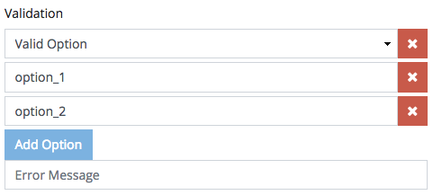

## 2.B.5. Characters Less Than

The number of characters in the field should be less than the given number.

## 2.B.6. Characters Less Than Equals

The number of characters in the field should be less than or equal to the given number.

## 2.B.7. Characters Greater Than

The number of characters in the field should be greater than the given number.

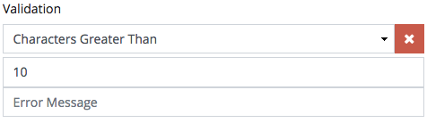

## 2.B.8. Characters Greater Than Equals

The number of characters in the field should be greater than or equal to the given number.

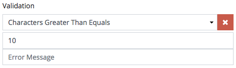

## 2.B.9. Words Less Than

The number of words in the field should be less than the given number.

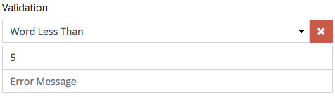

## 2.B.10. Words Less Than Equals

The number of words in the field should be less than or equal to the given number.

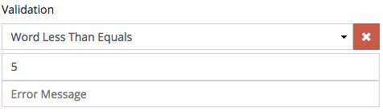

## 2.B.11. Words Greater Than

The number of words in the field should be greater than the given number.

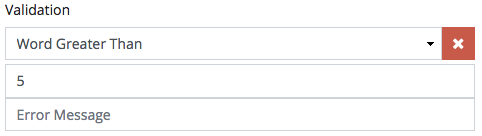

## 2.B.12. Words Greater Than Equals

The number of words in the field should be greater than or equal to the given number.

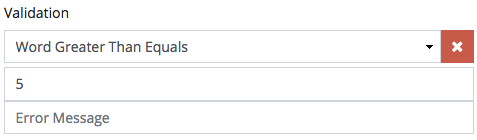

## 2.B.13. Valid Number

The field should contain a valid number *(integer or float)*.

## 2.B.14. Valid Float

The field should be a valid float *(or decimal ie. 0.224)*.

## 2.B.15. Valid Price

The field should have a valid price format *(integer with 2 decimal places. ie. 456.12)*.

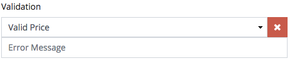

## 2.B.16. Less Than

Field should be less than the given number.

## 2.B.17. Less Than Equals

Field should be less than or equal to the given number.

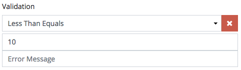

## 2.B.18. Greater Than

Field should be greater than the given number.

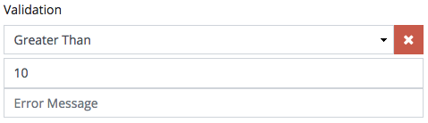

## 2.B.19. Greater Than Equals

Field should be greater than or equal to the given number.

## 2.B.20. Valid Date

Field should have a valid SQL date format *(YYYY-MM-DD)*.

## 2.B.21. Valid Time

Field should have a valid SQL time format *(HH:mm:ss)*.

## 2.B.22. Valid Date Time

Field should have a valid SQL date/time format *(YYYY-MM-DD HH:mm:ss)*.

## 2.B.23. Valid Email

Field should have a valid email address format.

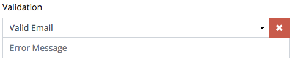

## 2.B.24. Valid Credit Card

Field should have a valid credit card format.

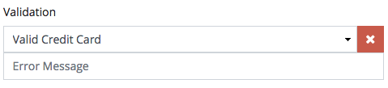

## 2.B.25. Valid Expression

