# 2.C. Reference: Schema Format Types

 - [2.C.1. Lower Case](#lower)
 - [2.C.2. Upper Case](#upper)
 - [2.C.3. Capitalize](#capital)
 - [2.C.4. Character Length](#char)
 - [2.C.5. Word Length](#word)
 - [2.C.6. Date Format](#date)
 - [2.C.7. Relative Format](#relative)
 - [2.C.8. Raw HTML](#html)
 - [2.C.9. Strip HTML](#strip)
 - [2.C.10. Markdown](#markdown)
 - [2.C.11. Link](#link)
 - [2.C.12. Image](#image)
 - [2.C.13. Email](#email)
 - [2.C.14. Phone](#phone)
 - [2.C.15. Formula](#formula)
 - [2.C.16. Comma Separated](#comma)
 - [2.C.17. Price Format](#price)
 - [2.C.18. Yes/No](#yes)
 - [2.C.19. Custom Format](#custom)
 - [2.C.20. Dont Show](#hide)
 - [2.C.21. No Filter](#none)

Output formats are used to display the correct representation of a value. If you
can't find the format you need, you can create a custom format with
[Custom Format](#custom). This accepts all the
[Handlebars Helpers](./4.B.-Reference-Handlebars-Helpers.html).

<a name="lower"></a>
## 2.C.1. Lower Case

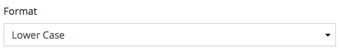

Transforms the value to lower case.

```
Foo Bar -> foo bar
```

<a name="upper"></a>
## 2.C.2. Upper Case

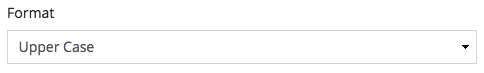

Transforms the value to upper case.

```
Foo Bar -> FOO BAR
```

<a name="capital"></a>
## 2.C.3. Capitalize

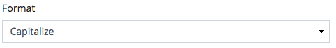

Capitalizes the value.

```
foo bar -> Foo Bar
```

<a name="char"></a>
## 2.C.4. Character Length

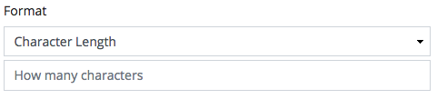

Limits the value to the specified amount of characters

###### Given that length is 5
```
foo bar -> foo b
```

<a name="word"></a>
## 2.C.5. Word Length

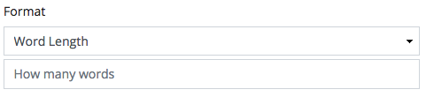

Limits the value to the specified amount of words

###### Given that length is 1
```
foo bar -> foo
```

<a name="date"></a>
## 2.C.6. Date Format

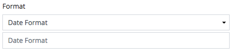

Formats the value to a specified date format

###### Given that the format is `F d, Y`
```
2018-01-01 -> January 01, 2018
```

<a name="relative"></a>
## 2.C.7. Relative Format

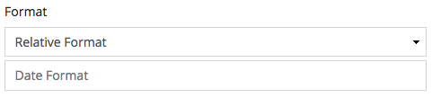

Formats the value to a specified relative date format

###### Given that the format is `F d, Y`
```
2018-01-01 -> 3 months ago
```

###### Given that the format is `F d, Y`
```
2016-01-01 -> January 01, 2016
```

<a name="html"></a>
## 2.C.8. Raw HTML

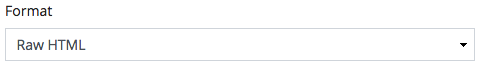

If the value contains HTML, by default we escape these tags. This format will
allow the use of HTML as an output

<a name="strip"></a>
## 2.C.9. Strip HTML

Strips HTML from the value

###### Given that allowable is '<b>'
```
<p>something <b>strong</b> happened</p> -> something <b>strong</b> happened
```

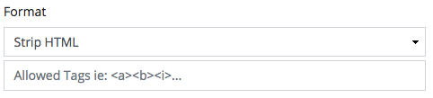

<a name="markdown"></a>
## 2.C.10. Markdown

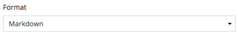

If the value contains Markdown, this will convert it to HTML.

<a name="link"></a>
## 2.C.11. Link

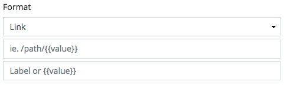

Converts value to a link tag. The first parameter is the value of the href
attribute of the link tag. The second parameter is for the inner text of the
link tag.

###### Given `/some/link` and `Foobar`
```
<a href="/some/link">Foobar</a>
```

Both parameters can optionally accept Handlebars variables. Handlebars
variables are relative to the model that is using this format.

###### For example if `article` and has field called `title` ...
```
/some/path/{{article_title}}
```


<a name="image"></a>
## 2.C.12. Image

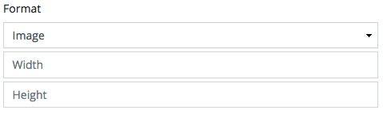

Converts a value to an image tag.

###### Given width is 100 and height is 200
```

```

<a name="email"></a>
## 2.C.13. Email

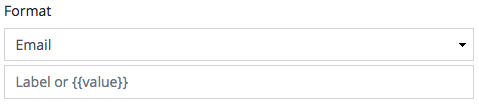

Converts value to an email link.

###### Given `john@doe.com` and `Foobar`
```
<a href="mailto:john@doe.com">Foobar</a>
```

<a name="phone"></a>
## 2.C.14. Phone

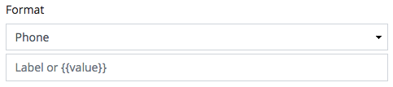

Converts value to an email link.

###### Given `555-2424` and `Foobar`
```
<a href="tel:555-2424">Foobar</a>
```

<a name="formula"></a>
## 2.C.15. Formula

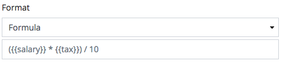

Compiles the given Handlebars template and evaluates the final formula.

Given
 - `product` has `price` and `tax`
 - `price` is 100
 - `tax` is 20

```
{{product_price}} + {{product_tax}} -> 100 + 20 -> 120
```

<a name="comma"></a>
## 2.C.16. Comma Separated

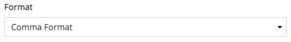

Joins an array into a comma separated string

<a name="price"></a>
## 2.C.17. Price Format

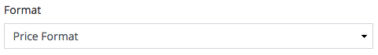

Adds commas and 2 decimal places to the number value

<a name="yes"></a>
## 2.C.18. Yes/No

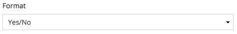

Transforms the value to either Yes or No.

```
1 -> Yes
0 -> No
```

<a name="custom"></a>
## 2.C.19. Custom Format

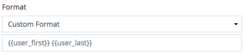

Compiles the given Handlebars template.

Given
 - `product` has `name` and `price`
 - `name` is iphone
 - `price` is 1000

```
{{product_name}} - ${{product_price}} -> iphone - $1000
```

<a name="hide"></a>
## 2.C.20. Dont Show

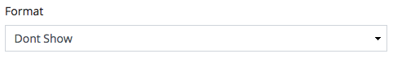

Hides the value

<a name="none"></a>
## 2.C.21. No Filter

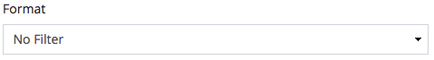

Performs no formatting on the value
