# 2.2. Populating Models

 - [2.2.1. Article Search](#search)
 - [2.2.2. Create an Article](#create)
 - [2.2.3. Copy an Article](#copy)
 - [2.2.4. Removing and Restoring](#remove)
 - [2.2.5. Importing and Exporting](#exporting)

Last we left off in [2.1. Creating a Schema](./2.1.-Creating-a-Schema.html),
we were able to create an **Article Schema** which will be used here. In this
chapter, we can now begin to populate the **Article Object**, ready to use in
our admin.

Go back to the **Schema Search Page**, and click the link described in the image
below. Alternatively you can manually go to
`127.0.0.1:8888/admin/system/model/article/search`.

###### Figure 2.2.A. Navigating to Article Search
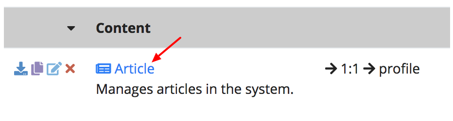

<a name="search"></a>
## 2.2.1. Article Search

When we visit this page, we see that the there are zero articles created.
That is expected since we just finished creating the **Article Schema**.
You will already notice that the **icon**, **singular** and **plural** form in
the **Article Schema** we defined in the last chapter
[last chapter](./2.1.-Creating-a-Schema.html) are used directly on
this page. Other buttons and actions found here will be covered later in this
chapter.

On the top right of that screen, click the green **Create Article** button.

###### Figure 2.2.1.A. Article Search
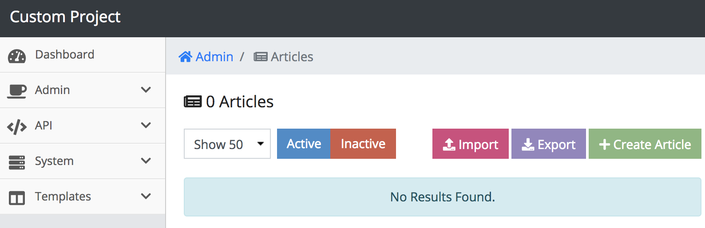

<a name="create"></a>
## 2.2.2. Create an Article

The first thing you notice is the **Profile Field**. This field is here because we
declared that an article has a one-to-one *(1:1)* relationship with `profile` covered in the
[last chapter](./2.1.-Creating-a-Schema.html). The **Profile Field** is an
autocomplete field that pulls its data from the **Profile Table** in the database.
The way it suggests the **Profile Name** is similarly described in the suggestion
field we covered in the [last chapter](./2.1.-Creating-a-Schema.html).

###### Figure 2.2.2.A. Article Form
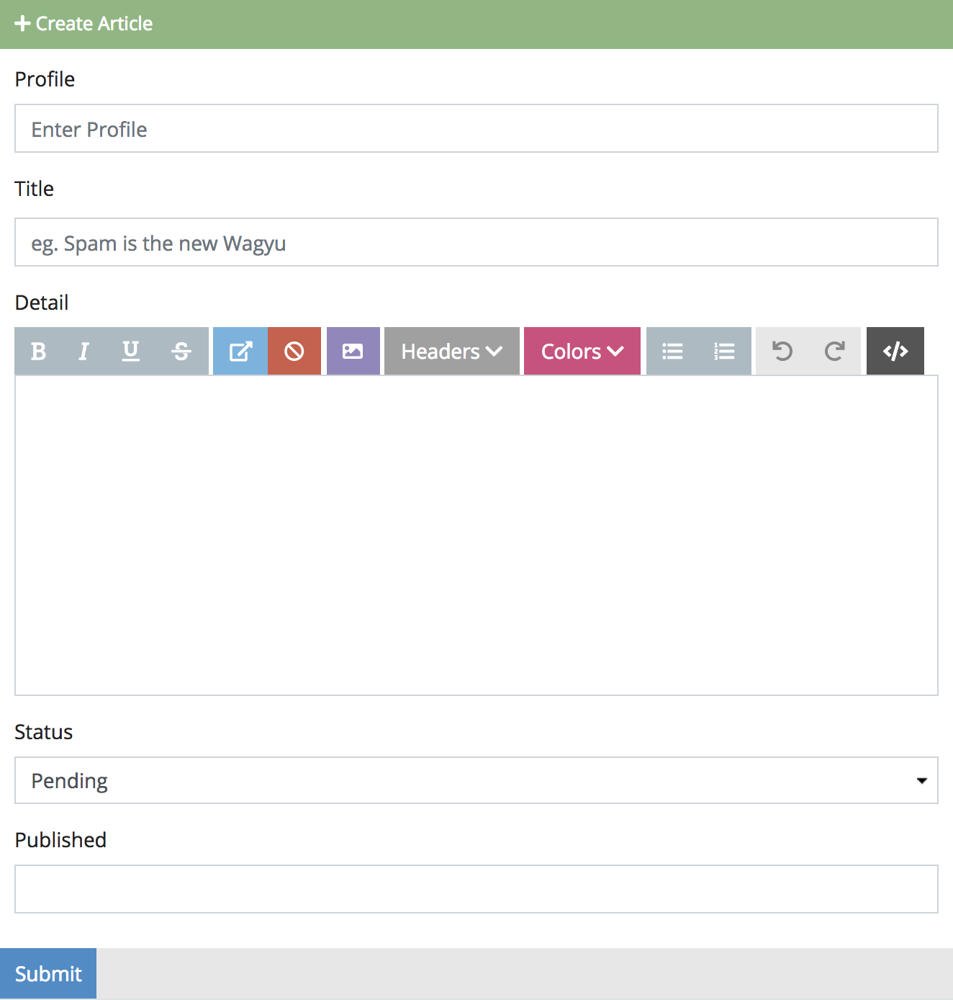

Since we only have one profile, the obvious choice is `John Doe`. The second
thing you should see is the `eg. Spam is the new Wagyu` as a placeholder in the
title. This was the same attribute used also in the
[last chapter](./2.1.-Creating-a-Schema.html). More information about field
types can be found in [2.A. Reference: Field Types](./2.A.-Reference-Field-Types.html).

Before we continue, let's submit the form to see what happens.

###### Figure 2.2.2.B. Article Form Errors
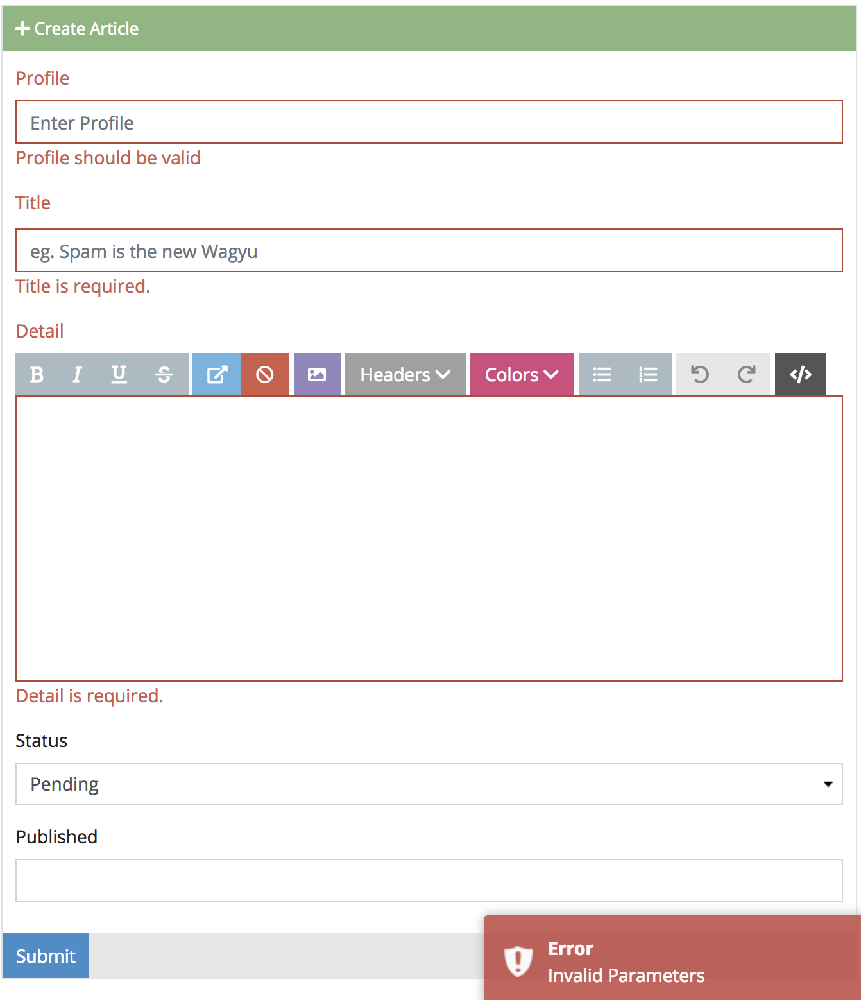

Since we only made the **Title** and **Detail** required, those were the only two
custom validation triggers that were fired. **Status** did not trigger an error,
because `pending` was a valid choice. Since we made `profile` a `1:1`
relationship it also implies that it is required as well. If you wanted to make
the profile optional, you can go back to your **Article Schema** and change the
relationship with profile to `1:0` instead.

At any rate let's continue to populate the first article as planned.

###### Figure 2.2.2.C. First Article
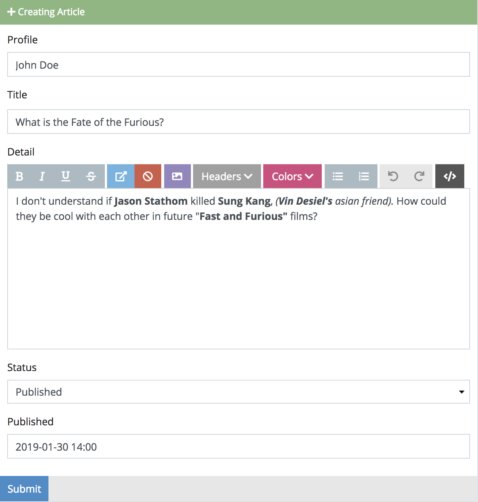

When we press **Submit**, we should be redirected back to the **Article Search Page**
showing our new entry. On the left side of our entry, we see mini action
icons that perform particular actions for that row. Those actions are described
below in order from left-to-right.

 - **Copy** - *(purple)*; Copies the **Article Object**
 - **View** - *(blue)*; Redirects to the **Article Detail Page**
 - **Edit** - *(grey)*; Redirects to the **Article Update Form**
 - **Remove** - *(red)*; Removes the **Article Object**

```info
INFO: If you forget what those actions do per row, just hover over it and the
browser default tooltip will remind you.
```

<a name="copy"></a>
## 2.2.3. Copy an Article

To the far left of the row action column there is a purple icon when clicked,
will redirect you to the **Create Article Page**, but populate the form with
the contents of that row. This is called the **copy** action.

###### Figure 2.2.3.A. Copy Action
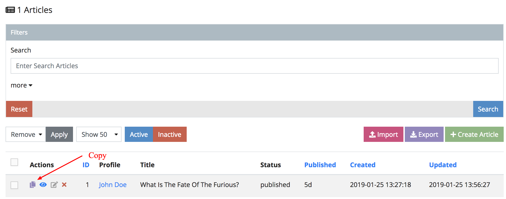

Go ahead and click it. From here we can just simply change the **Title**,
**Detail** and leave the rest as is.

###### Figure 2.2.3.B. Second Article
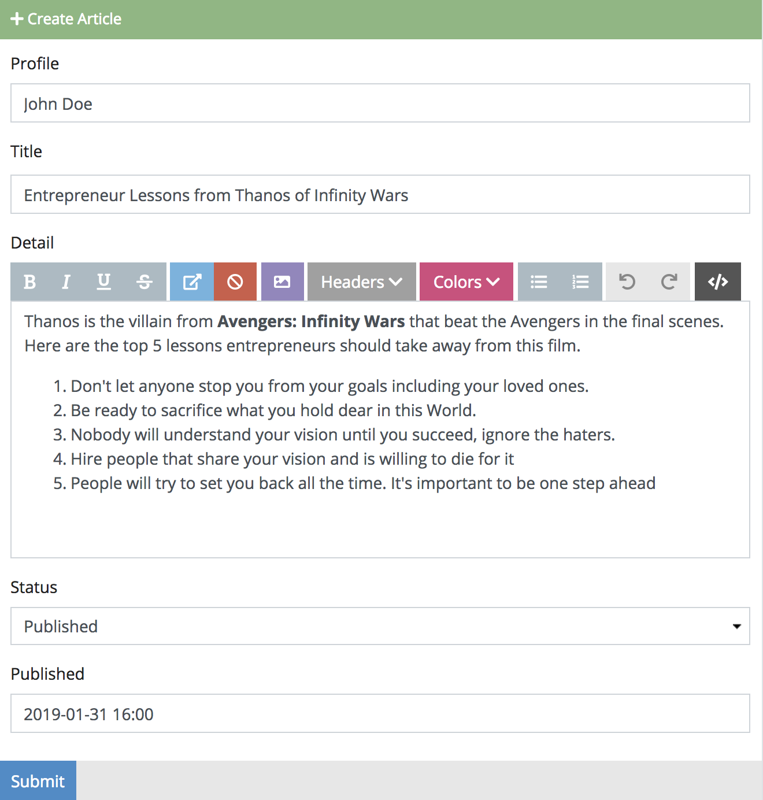

When we press `Submit`, we should be redirected back to the **Article Search Page**
showing our new copied entry.

<a name="remove"></a>
## 2.2.4. Removing and Restoring

**Article Objects** can be removed and restored as well. The ability for an
object to be restorable depends on whether you added the special **Active** field
type in your schema.


Since we did that in the [last chapter](./2.1.-Creating-a-Schema.html),
we are free to remove articles without fear of permanently removing them.

```warning
WARNING: If you did not make an Active Field in your Article Schema, removing your
Article Object will permanently remove it. In other words, there's no going back.
```

###### Figure 2.2.4.A. Remove Action
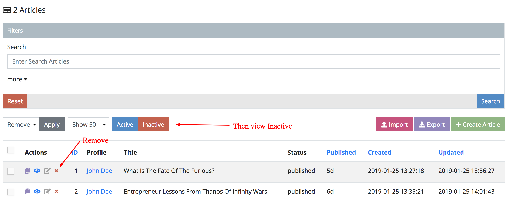

Go ahead and remove an **Article Object**, then click the **Inactive Tab** after.
You should be able to see your removed article in this list as shown in the image
below.

###### Figure 2.2.4.B. Restore Action
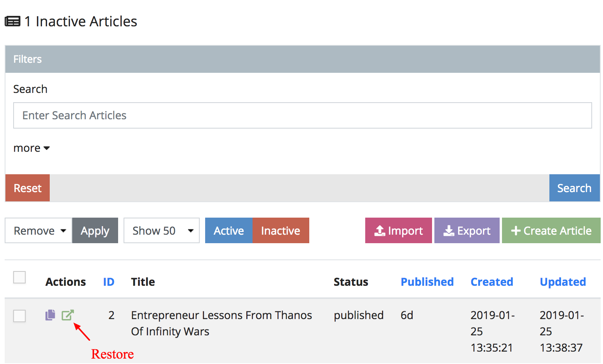

If you would like to restore the article once again, just click the green icon
on the left to restore it.

```info
INFO: After clicking that, you might be confused why the Article Search Page is
now empty. This is because you are still in the Inactive Tab.
```

<a name="exporting"></a>
## 2.2.5. Importing and Exporting

On the top right of the **Article Search Page** next to **Create Article** you
should see a purple button called **Export**. Clicking this will create a *CSV*
file of your results and cause your browser to download it. Opening this file
you can see the data as shown similarly below.

###### Figure 2.2.5.A. Exporting Tool
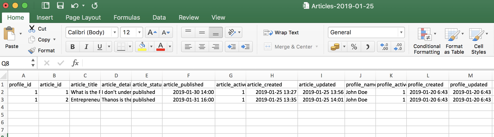

Sometimes when manipulating mass amounts of data at the same time *(bulk action)*
it's easier working on just one file and importing into the system. Before we
import the file back up, let's remove unnecessary columns. These include the
following.

 - `article_id` - Since IDs are automatically generated, there's no need to
 specify. Alternatively you can keep it here, but it will update that article
 instead.
 - `article_published` - Since we will be creating pending articles, and according
 to our **Article Schema**, it's not required as well.
 - `article_active` - Creating an article will automatically set this to 1. Unless
 our intention is to remove articles, you can set it to 0.
 - `article_created` - The system won't allow you to change this manually.
 - `article_updated` - The system won't allow you to change this manually.
 - `profile_name` - Since we are importing in the **Article Search Page**,
 profile changes will be ignored.
 - `profile_active` - Since we are importing in the **Article Search Page**,
 profile changes will be ignored.
 - `profile_created` - Since we are importing in the **Article Search Page**,
 profile changes will be ignored. The system won't allow you to change this
 manually anyways.
 - `profile_updated` - Since we are importing in the **Article Search Page**,
 profile changes will be ignored. The system won't allow you to change this
 manually anyways.

This should leave you with the columns described like the image below.

###### Figure 2.2.5.B. Removing Unnecessary Columns
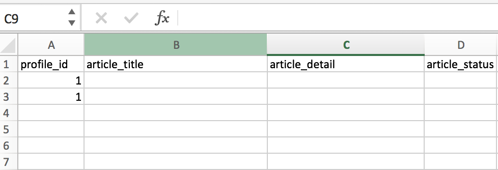

We can now add any additional articles to the CSV file like the example below.
Feel free to add more if you like.

###### Figure 2.2.5.C. Adding Rows
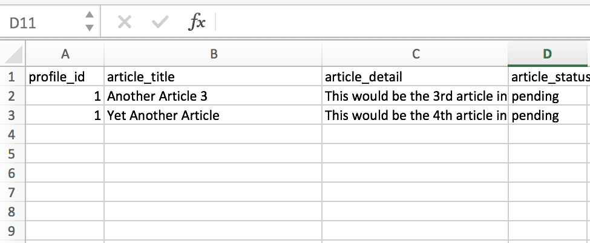

When we are happy with our CSV file, click the pink **Import** button next to the
**Export** button in the **Article Search Page**. Choose the file we just worked
with and click **Open**. This will upload the imported file and begin to bulk
create **Article Objects**.

```warning
WARNING: Make sure it is a .csv file, not a .xls or .xlsx
```

###### Figure 2.2.5.D. Imported Rows
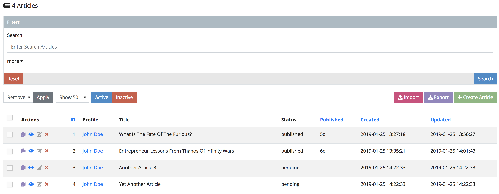

<a name="conclusion"></a>
## 2.2.6. Conclusion

In this chapter we covered how to work with **Articles**. If schemas contain
information about objects, we use objects and models synonymously. This section
can be generically applied to any model you want populated in the admin. In the
next section [2.3. Working with Relations](./2.3.-Working-With-Relations.html),
we will discover how models relate to each other, relationship types and how to
they are perceived in the admin.
