# 2.3. Working with Relations

 - [2.3.1. Comment Schema](#comment_schema)
 - [2.3.2. Relating Comments](#relate_comments)
 - [2.3.3. Relation Actions](#relation_actions)
 - [2.3.4. Relating to Itself](#recursive)

In the last chapter [2.2. Populating Models](./2.2.-Populating-Models.html),
we started seeing the usefulness of creating schemas and swiftness of managing
**Articles**. In this chapter we will be creating another schema called
**Comment**, relating it to our existing **Article Schema** and understanding
how the admin interprets different kinds of relationships. We call a group of
schemas related to each other a system.

<a name="comment_schema"></a>
## 2.3.1. Comment Schema

Let's go back to `http://127.0.0.1:8888/admin/system/schema/search`.
You should populate the **Comment Schema** information like the image below.
This process is similar to what we did in
[2.1. Creating a Schema](./2.1.-Creating-a-Schema.html).

###### Figure 2.3.1.A. Comment Schema Information
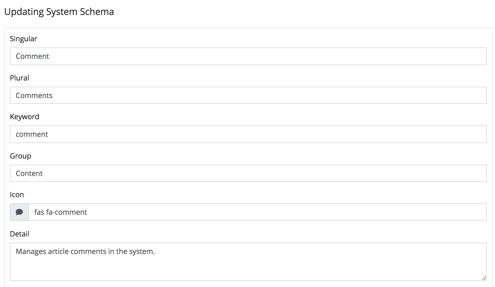

Again I provided a cheat sheet to help populate the fields of the **Comment Schema**
faster. If any of this doesn't sound familiar please visit
[2.1. Creating a Schema](./2.1.-Creating-a-Schema.html) to get back up to speed.

###### Figure 2.3.1.B. Comment Fields
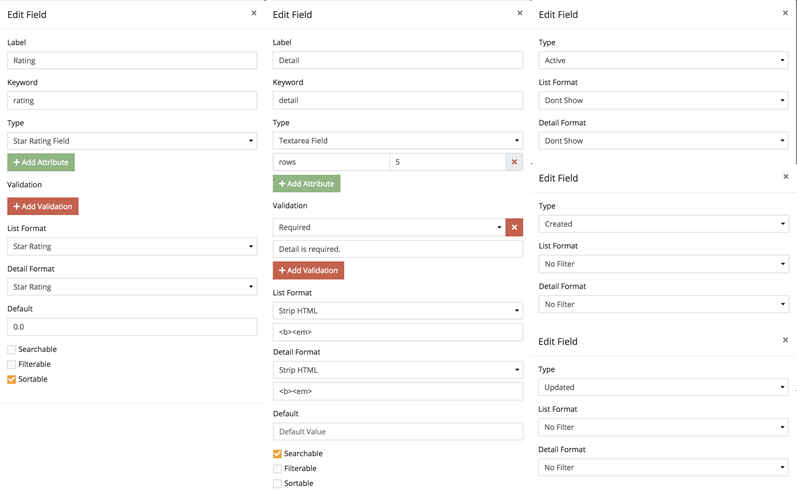

If you entered the fields correctly your field table should look exactly like the
image below.

###### Figure 2.3.1.C. Comment Field Table
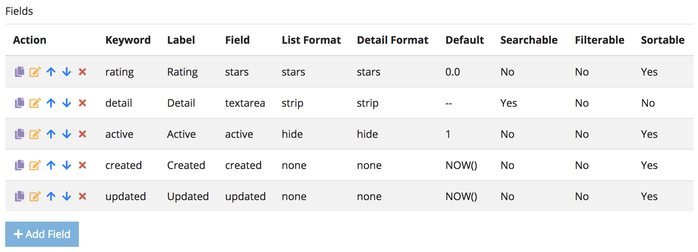

Next lets add a `1:1` relation to `profile` since *"a **Comment** should have
an **Author**"*.

###### Figure 2.3.1.D. Comment Relations and Suggestions
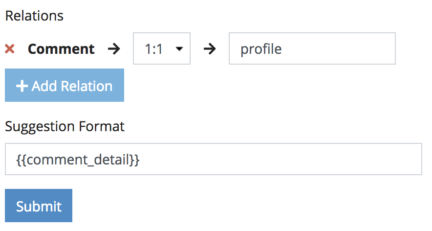

Go ahead an save the **Comment Schema**. The next thing we need to do is relate
an **Article** with a **Comment**

<a name="relate_comments"></a>
## 2.3.2. Relating Comments

Go to `http://127.0.0.1:8888/admin/system/schema/update/article` and under the
*Relations* section towards the bottom. Add a new relation to **Comment** that
looks like the image below.

###### Figure 2.3.2.A. Article Can Have Many Comments
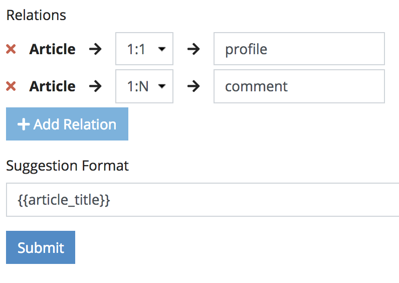

Go ahead and update the **Article Schema** and you should be redirected back to
the **Schema Search Page** with the following relations below now set.

###### Figure 2.3.2.B. Schema Summary
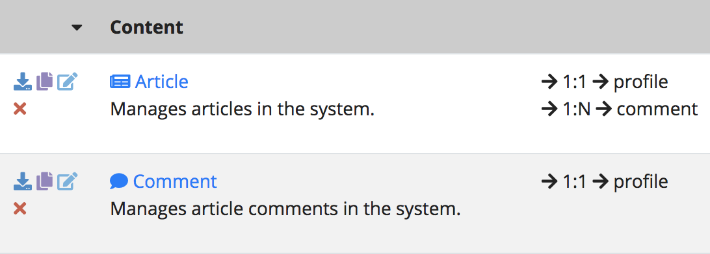

Let's revisit the **Article Search Page** at
`http://127.0.0.1:8888/admin/system/model/article/search`.

<a name="relation_actions"></a>
## 2.3.3. Relation Actions

You should notice that there is a new row action that looks like a
*blue speech bubble*. This is the result of setting a `1:N` relation with
`comment`.

```info
INFO: The blue icon may differ, depending on what icon you chose for the Comment
Schema.
```

###### Figure 2.3.3.A. Relation Actions
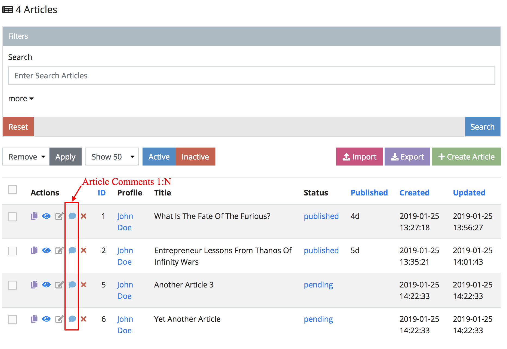

If you click through one of those row actions, you will be redirected to a
special relation page that particularly shows options on how a **Comment** can
relate to an **Article**.

###### Figure 2.3.3.B. Article Comment Search
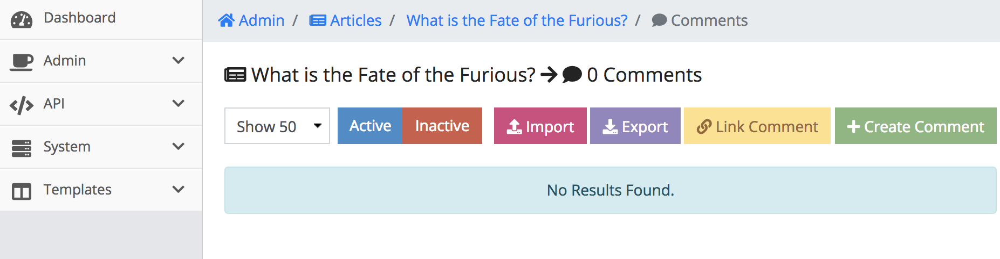

Much like when we first visited the **Article Search Page** for the first time,
there are similarities between the two search pages. The first thing to notice
is the **Page Title** shows the **Title** of the **Article Object** then points
to the number of **Comment Objects** related to that **Article Object**.

```
What is the Fate of the Furious? -> 0 Comments
```

This helps us remember what kind of search page we are in. In fact, we call this
kind of page a **Relational Search Page**. The other thing we notice is an
additional button on the top right called **Link Comment**. Let's leave this
alone for now, as it is covered later in this chapter.

The next thing to do is create a **Comment Object**. Click the green **Add Comment**
button on the top right. When we create a **Comment Object** this way, it will
create it and automatically link the new comment with the respective
**Article Object**.

###### Figure 2.3.3.C. Adding a Comment
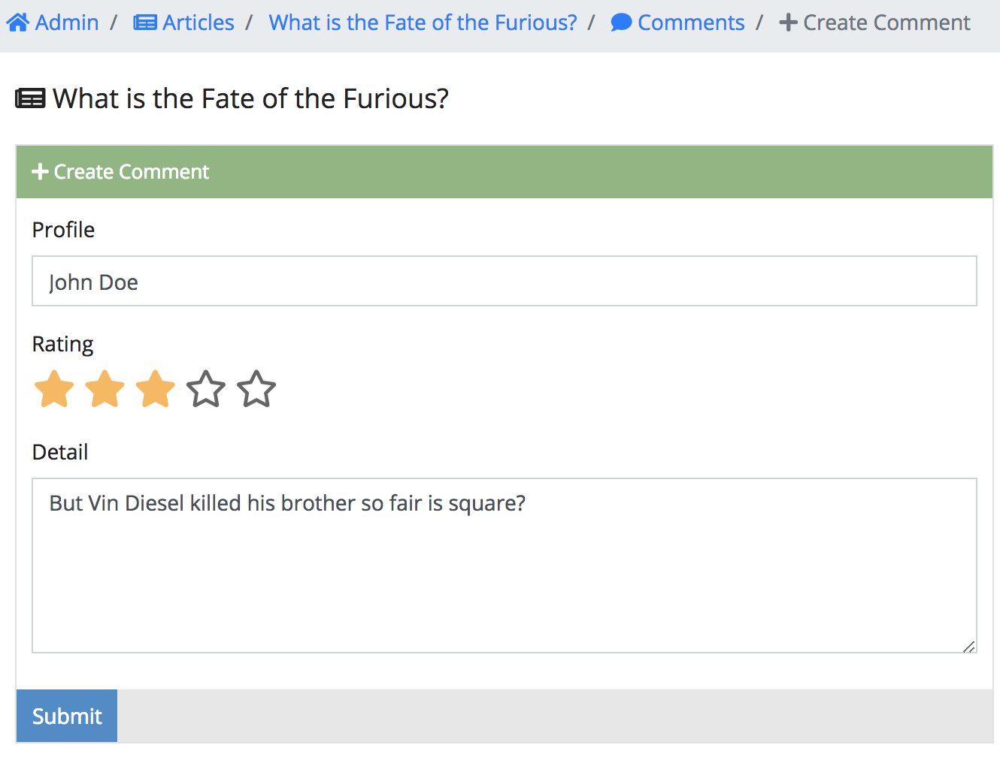

We should signify when an a form is linking to another object by the title of
the form, or in this case `What is the Fate of the Furious?`. Populate the form
and submit it. You should be redirected back to the **Relational Search Page**
with the comment created and linked to that **Article**.

When a **Comment Object** is created linking to an **Article Object**, a new
pink action row will show allowing you to unlink the **Comment Object** if you
so wish. Right now, go ahead and click it.

###### Figure 2.3.3.D. Unlink a Comment
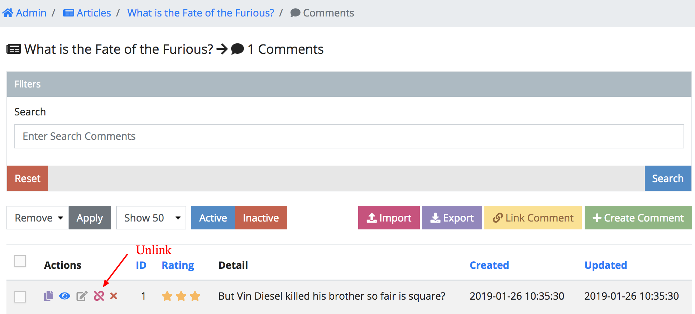

This will unlink the **Comment Object** from the **Article Object**, but the
**Comment Object** will still exist so don't worry. If we want to re-link the
**Comment Object** to the **Article Object** once again, click the yellow
**Link Comment** button on the top right.

###### Figure 2.3.3.E. Link a Comment
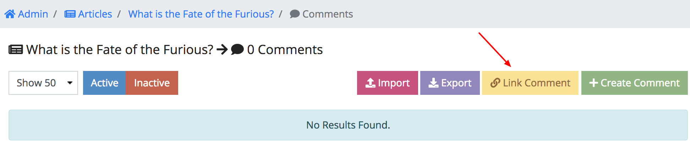

This will redirect you to a simple form where you can link a **Comment Object**.
Since we made `comment_detail` searchable just enter any word that exists in the
**Comment Objects** and the suggestion format of the **Comment Schema**
`{{comment_detail}}` will show.

###### Figure 2.3.3.F. Why Suggestions Matter
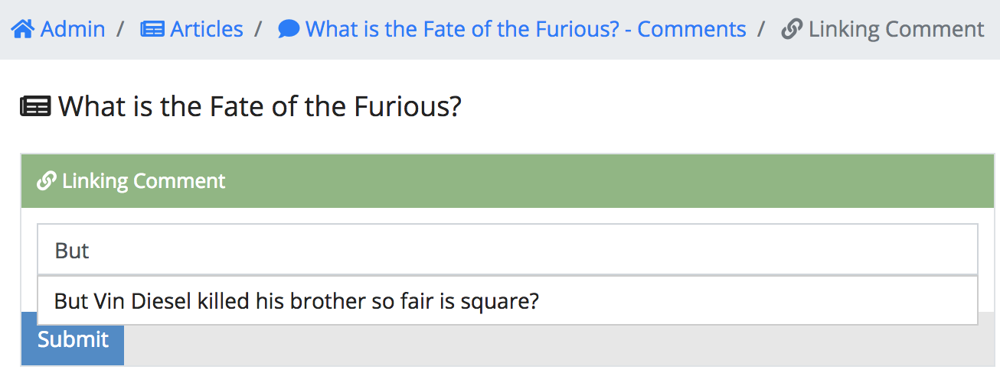

The suggestion format in the **Comment Schema** can be set to anything you want
and allows *[Handlebars](#)* variables as well. For example, you can enter
`{{comment_id}} - Hello` in the suggestion format field in
the **Comment Schema** and when you go back to *Figure 2.3.3.E. Link a Comment*
the autocomplete will show `1 - Hello` instead.

<a name="recursive"></a>
## 2.3.4. Relating to Itself

It is also possible for objects to relate to itself in some sort of recursive
fashion. In this case it could make sense that someone can comment on another
previous comment. Let's revisit the **Comment Schema Page** at
`http://127.0.0.1:8888/admin/system/schema/update/comment` and add a new
`1:N` relation to the **Comment Schema**.

###### Figure 2.3.4.A. Comment Can Have Many Comments


After you save this, the schema for both **Article** and **Comment** should look
like the following image below.

###### Figure 2.3.4.B. Schema Summary
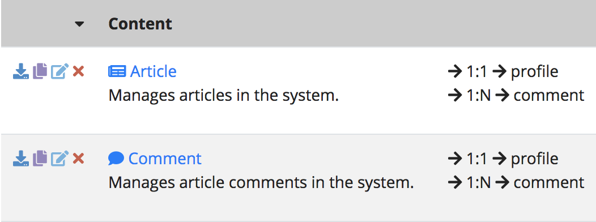

If you go back to an **Article Comments Search Page**, you should see another
*blue speech bubble*. If you click through that, you will see something similar
to the image below.

###### Figure 2.3.4.C. Comment Comment Search
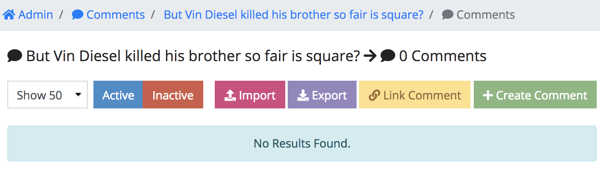

Click the green **Add Comment** button on the top right. When we create a
**Comment Object** this way, it will create it and automatically link the new
comment with the respective **Comment Object**.

###### Figure 2.3.4.D. Final Result
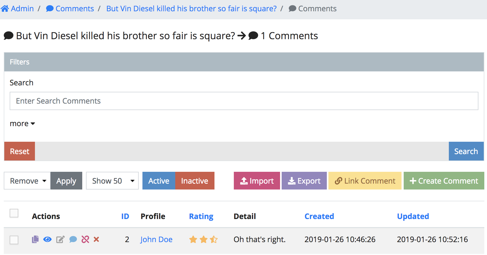

While its now clear what a one-to-one *(`1:1`)* and a one-to-many *(`1:N`)*
does, there are other relations you can take advantage of.

- one-to-zero *(`1:0`)* - **Object 1** can *(but not required)* relate to just
one **Object 2**. This relation  will reflect on a form page and reflect on the
detail page, but won't show on the search page.
- one-to-one *(`1:1`)* - **Object 1** is required to relate to just one
**Object 2**. This relation will be included in all **Object 1** search results,
form and detail pages.
- one-to-many *(`1:N`)* - **Object 1** can relate to many **Object 2**'s. This
will create a special row action per **Object 1** in the search page and will
lead to a special relational pages.
- many-to-many *(`N:N`)* - Many **Object 1** can relate to many **Object 2**'s
and vice versa. This means in both **Object 1** and **Object 2** search pages,
a special row action will show leading to special relational pages about each
other respectively.

```warning
If you update a schema to have a 1:1 relation, previous created rows will not
show since they are not related to the required object.
```

<a name="conclusion"></a>
## 2.3.5. Conclusion

In this chapter we created another schema called **Comment** and related it to
our existing **Article Schema**. We also made a **Comment Schema** relate to itself.
Based on just these constructs, we can create complicated systems without needing
to open a code editor. This also helps bridge the gap between client and code
business rules much easier. In the next section,
[2.4. Adding Menu Items](./2.4.-Adding-Menu-Items.html) we are going to
briefly cover how create admin navigation for your schemas.
