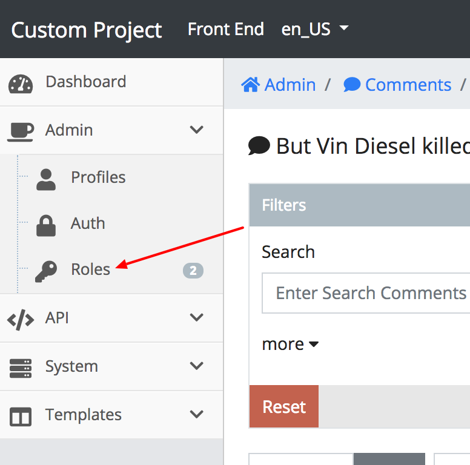
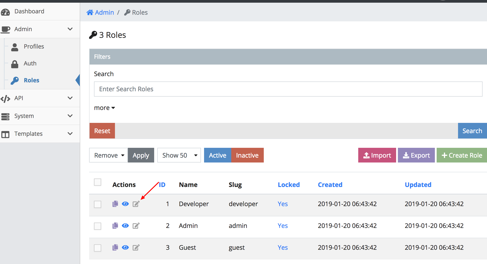
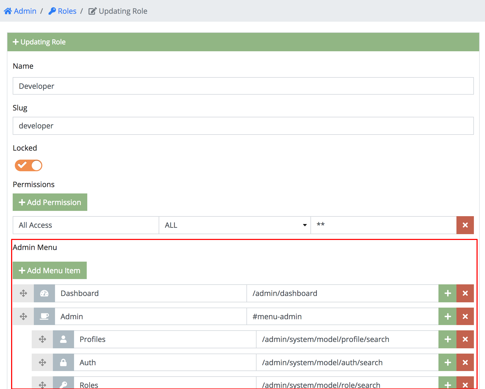
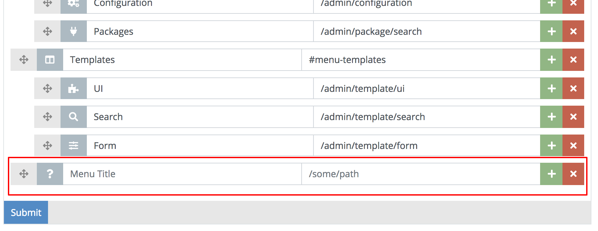
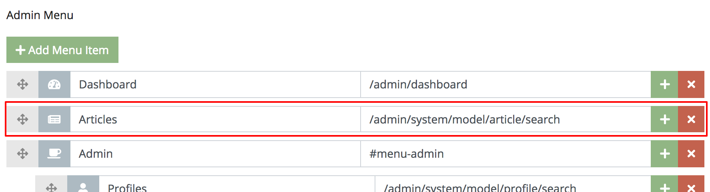
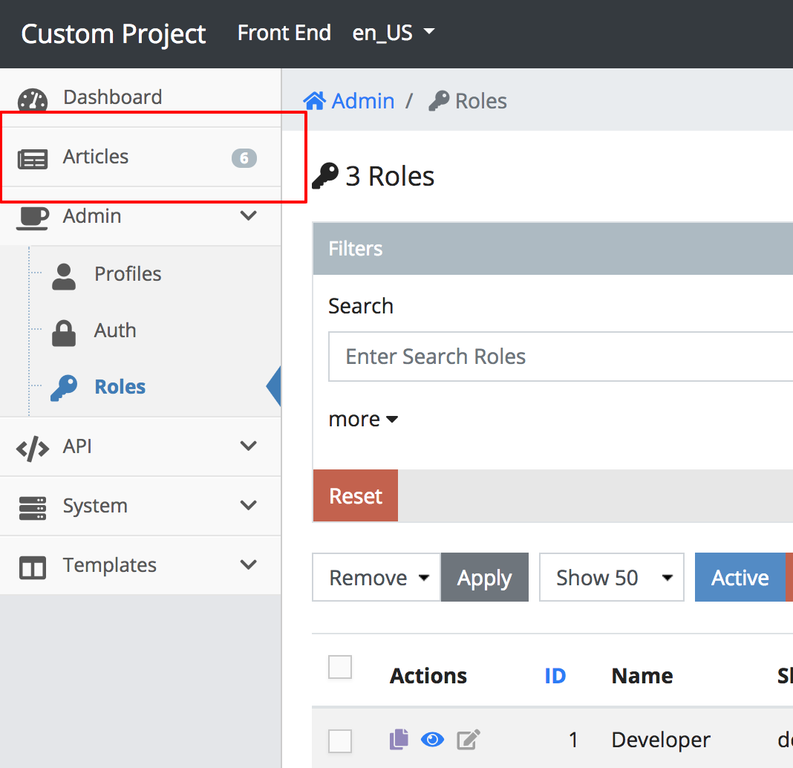

# 2.4. Adding Menu Items

In the last chapter
[2.3. Working with Relations](./2.3.-Working-With-Relations.html), we went
over how to relate an **Article** with a **Comment**. Today, we will be looking
briefly how to add an admin menu item called **Articles**.

Updating menu items are not obviously found as we will later discover. This is
because roles can have different menus depending on what their purpose is for in
the admin. This is why we need to look for admin menus in the roles section of
the admin.

If you open the admin menu on the left side of your admin you will see a roles
menu item. Go ahead and click it.

###### Figure 2.4.A. Menu is Found in Roles


This will bring you to a list of three predefined roles. We will be covering
more about roles in the next chapter
[2.5. Roles & Permissions](./2.5.-Roles-&-Permissions.html). For now we want
to exclusively deal with the `developer` role. Find the row actions for
`developer` and click the grey update action.

###### Figure 2.4.B. Edit Developer Role


If you scroll down you will eventually see a section called `Admin Menu`. The
interface of a menu item consists of six elements which the following items
describe respectively left-to-right.

 - **Sort Button** - Click and drag this vertically to help order the menu easier.
 - **Icon Field** - Choose from a drop down of [Font Awesome](https://fontawesome.com/icons)
 icons.
 - **Menu Title** - The display label of the menu item. You want to make sure
 this is less than 50 characters to stay within the responsive design of the admin
 - **Menu URL Link** - When the menu item is clicked where to go.
 - **Sub Menu Button** - Clicking this will add a child menu item. This only
 goes down to three levels.
 - **Remove Button** - Clicking this will remove the menu item and all of it's
 children.

###### Figure 2.4.C. Understanding the Menu Interface


Go ahead and click `Add Menu Item`.

```info
INFO: Menu items are created at the bottom of the menu, so you might need to
scroll down.
```

###### Figure 2.4.D. Add a Menu Item


Populate the menu item with the following values outlined.

 - **Icon Field** - Choose any icon.
 - **Menu Title** - Enter **Articles**
 - **Menu URL Link** - Enter `/admin/system/model/article/search`

 Also re-order the **Articles** menu item so it shows right below the
 **Dashboard** menu item so it looks like the image below.

###### Figure 2.4.E. Ordering Menu Items


When your done, scroll back to the bottom of the form and hit submit. If you
look at your admin menu in the top left, you should see your new **Articles**
menu item like the image below. Clicking it should redirect you to the
**Articles Search** page.

```info
If you are redrected to a 404 page, it means you didn't enter the menu path correctly.
```

###### Figure 2.4.F. Final Results


<a name="conclusion"></a>
## Conclusion

While we did create a menu item, it also spawns a bunch of new questions about
roles, how do they get assigned and why the three predefined roles? In the next
chapter [2.5. Roles & Permissions](./2.5.-Roles-&-Permissions.html), we will
be answering these questions and more.
