# 2.6. Creating a Fieldset

 - [2.6.1. Creating a Reference Fieldset](#creating)
 - [2.6.2. Adding Reference to Article](#article_schema)
 - [2.6.3. Revisiting Articles](#article_model)
 - [2.6.4. Single Fieldset](#single)

So going back to the use case of an **Article**. An article could be using
references from another publication found on another website. An **Article**
could use many references or even no references at all. These references are
usually "one off" and particular to the article in question, so we may not want
to create a schema for references.

This is a good use case to use fieldsets instead. A fieldset is similar to a
Schema *(in fact a schema is a type of fieldset)* that can be attached to an
object as a column instead of an exclusive schema itself. Other usages of
fieldsets include the following.

 - Advance form configuration sets
 - Capturing data in time
 - Further grouping fields that don't need any indexing of any kind.
 - Supports a NoSQL approach database design

For example when we think about an *Article Reference* it could have the
following properties.

 - **Title** - Text Field; required
 - **Link** - URL Field; required
 - **Quote** - Text Field; required
 - **Publication** - Text Field; optional

## 2.6.1. Creating a Reference Fieldset

Go to `http://127.0.0.1:8888/admin/system/fieldset/search` by opening the System
menu and clicking `Fieldsets`. Next click the green `Create Fieldset` to begin
creating a `Reference`.

###### Figure 2.6.1.A. Create a Fieldset
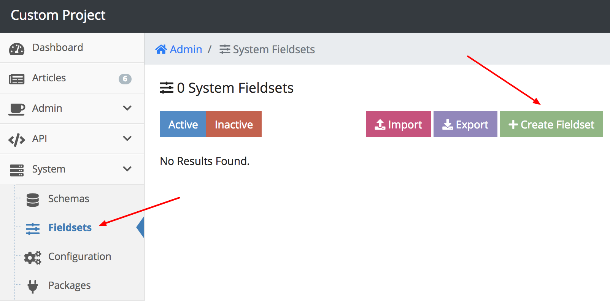

Since a schema is a "type of" fieldset, you will find this form somewhat familiar.
The following items describes what each field in the fielset information is and
recommendations on what to input.

 - **Singular** - **required**; This is the name of your object. Since we are
 going to create a schema called reference, enter **Reference** in that field.
 - **Plural** - **required**; This is the plural name form of the object. Enter
  **References** in that field.
 - **Keyword** - **required**; This will be the programatic name of the object.
 The keyword should not have any spaces, dashes, or any special characters
 besides, letters, numbers or an underscore. When you enter the **Singular**
 field, this field automatically got populated with **reference** leave that
 value alone for now.

If you were following this section thoroughly, then your schema form should look
like the following image.

###### Figure 2.6.1.B. Fieldset Form
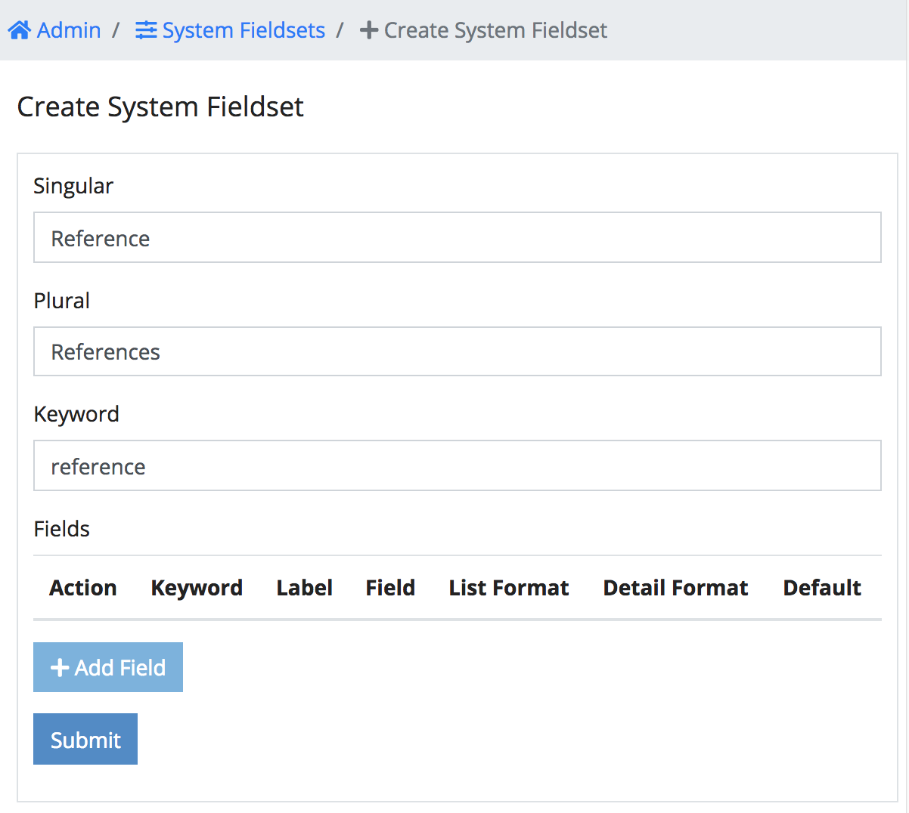

Continue to add the rest of the fields for the **Reference**. Provided below is a
summarized *cheat sheet* of recommended fields that should be added.

###### Figure 2.6.1.C. Adding More Fields
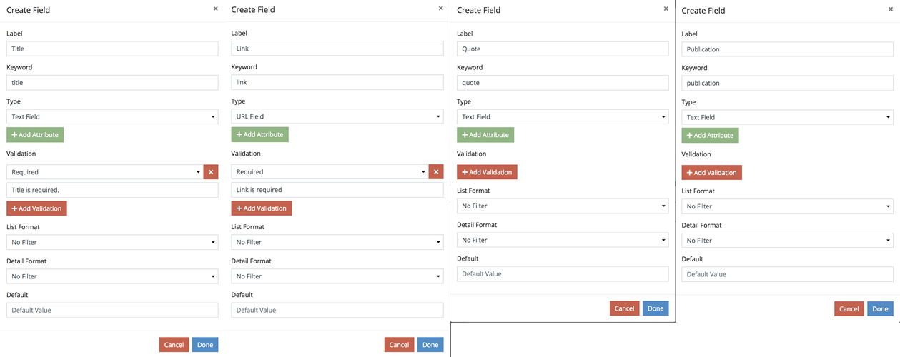

If you added all the fields correctly, your field table found in the schema form
should look like the following image. Go ahead and submit the form.

###### Figure 2.6.1.D. Field Summary
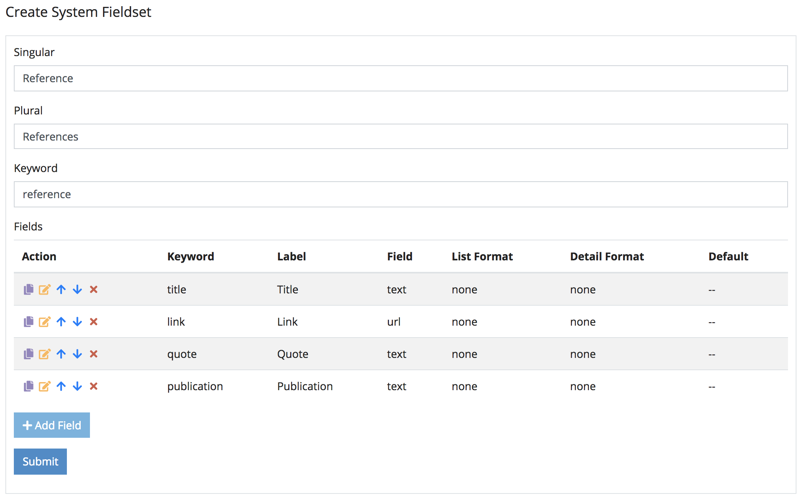

The `Reference` field is now created. The next thing to do is add this fieldset
to the **Article** schema.

###### Figure 2.6.1.E. Fieldset Search
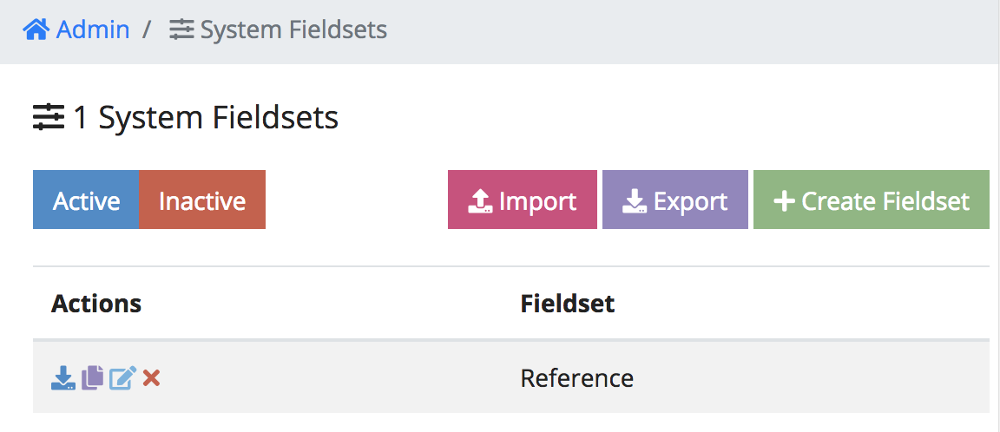

## 2.6.2. Adding Reference to Article

Navigate to the **Article** schema, by clicking the `System` menu drop down on
the left of the admin, clicking `Schema` then find the `Articles` schema and
click the *grey update icon*. Alternatively you can go to
`http://127.0.0.1:8888/admin/system/schema/update/article` manually.

###### Figure 2.6.2.A. Edit Article
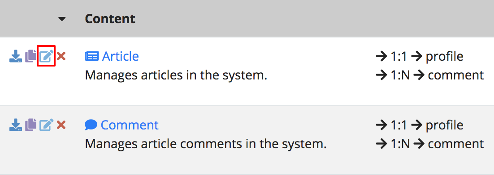

Look for the green `Add Field` button and click it. The following items
describes what each field in the `Add Field` form is and recommendations on what
to input.

 - **Label** - Enter **References** in that field.
 - **Keyword** - When you enter the **Label** field, this field
 automatically got populated with **references** leave that value alone for now.
 - **Type** - Choose **Custom Fieldset**. When you select that, an extra input
 will show asking for the fieldset keyword name. Enter `reference` *(lower case)*.
 This is the name of the fieldset we set in [2.6.1.A](./assets/2.6.1.A.png).
 - **Validation** - Leave this alone.
 - **List Format** - Choose `Don't Show`
 - **Detail Format** - Choose `Table`

If you were following this section thoroughly, then your field form should look
like the following image.

###### Figure 2.6.2.B. Add a Fieldset Field
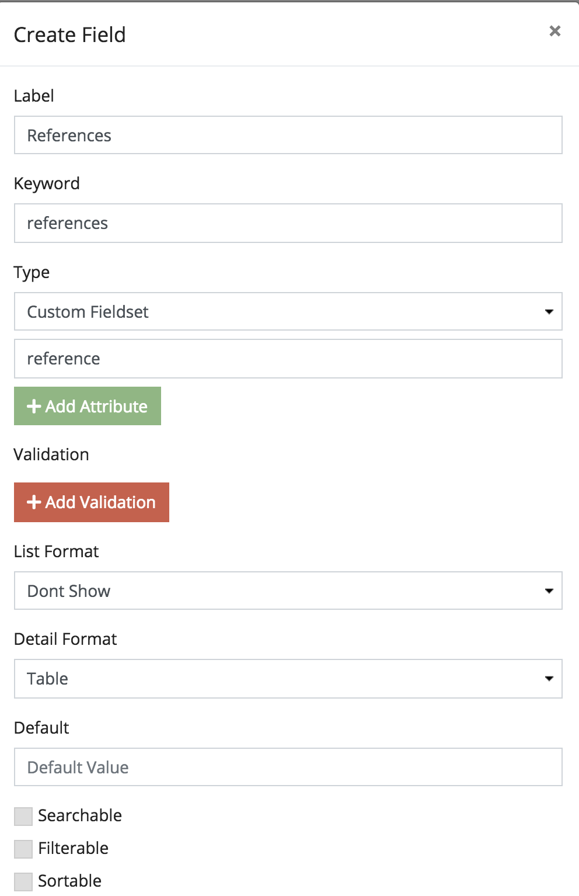

After you add the field, order its row so it appears above the `Active` field.

###### Figure 2.6.2.C. Ordering the References
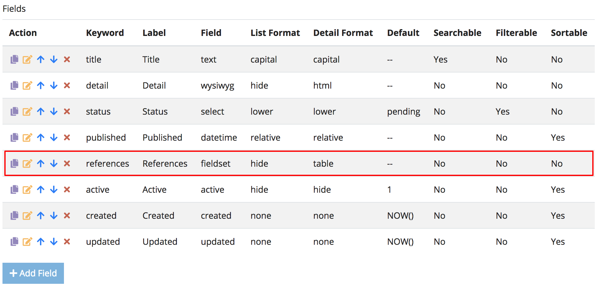

Submit that form and move on to the **Artcle Search** page and edit any existing
article.

## 2.6.3. Revisiting Articles

If you scroll down to the bottom you will eventually see your new field called
**References**. Click the green `Add Reference` button.

###### Figure 2.6.3.A. References Field
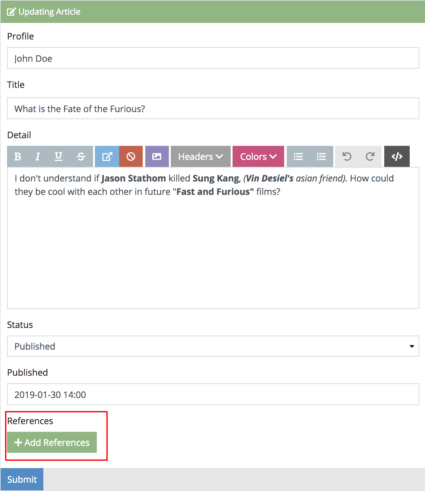

This will create a **Reference Fieldset** row. Similar to a `1:N` relation
*(though not exactly)*, it's possible now that an article can have zero or many
references.

###### Figure 2.6.3.B. Reference Form
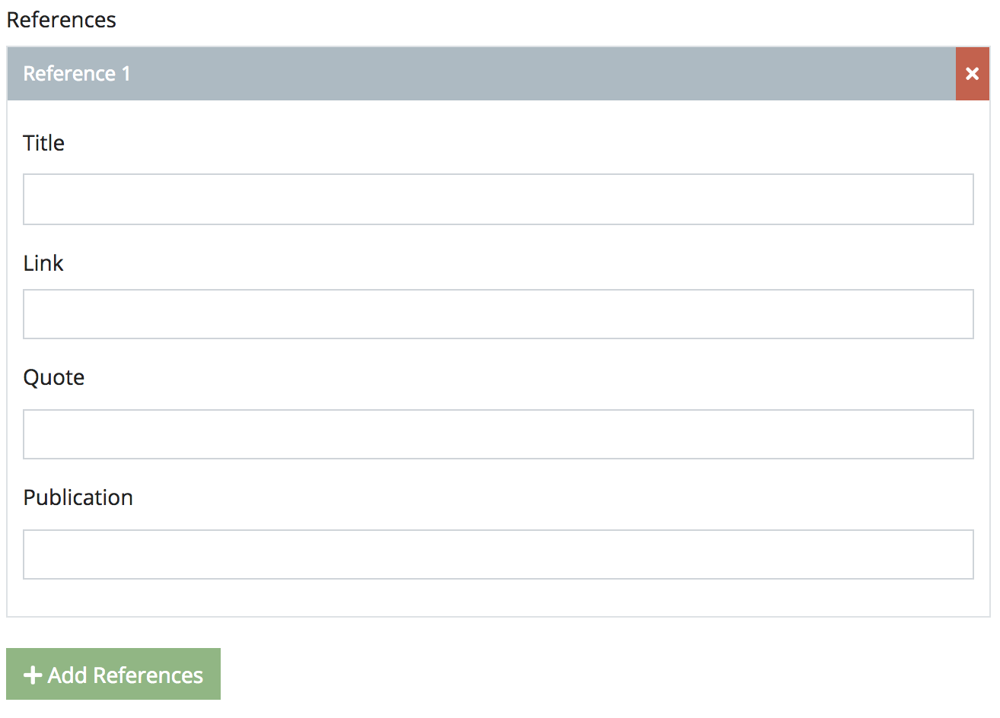

Before we submit let's first try to update the **Article** with an empty
**Reference Fieldset**

###### Figure 2.6.3.C. Reference Errors
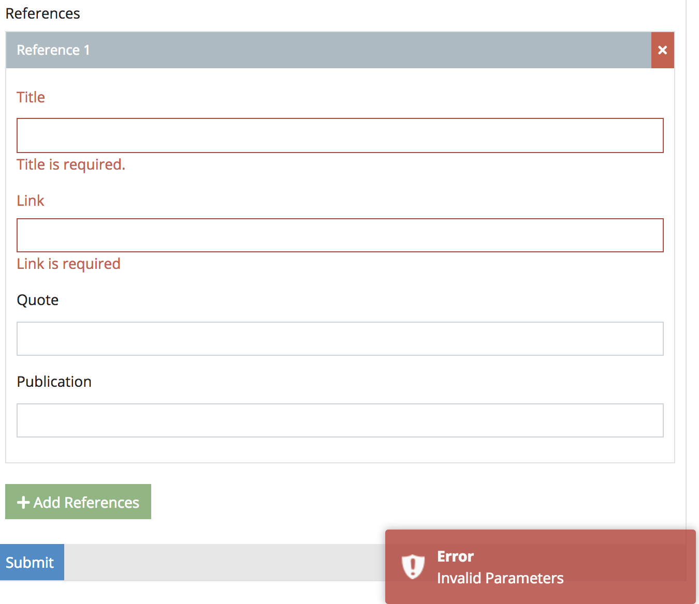

Since we only made the **Title** and **Link** required, those were the only two
custom validation triggers that were fired.

###### Figure 2.6.3.D. Populating a Reference
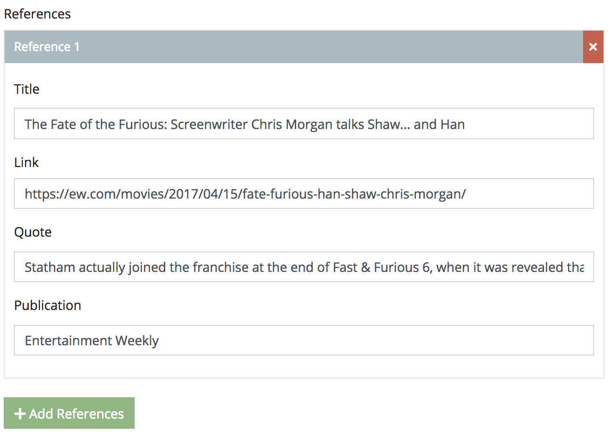

Go ahead and populate a reference and save. If you want, you can use the
following given values.

 - **Title** - Enter `The Fate of the Furious: Screenwriter Chris Morgan talks Shaw... and Han`
 - **Link** - Enter `https://ew.com/movies/2017/04/15/fate-furious-han-shaw-chris-morgan/`
 - **Quote** - Enter `Statham actually joined the franchise at the end of Fast & Furious 6, when it was revealed that he killed longtime Toretto crew member Han (Sung Kang) as the first step of his vengeance mission.`
 - **Publication** - Enter `Entertainment Weekly`

###### Figure 2.6.3.E. Navigating to View Reference
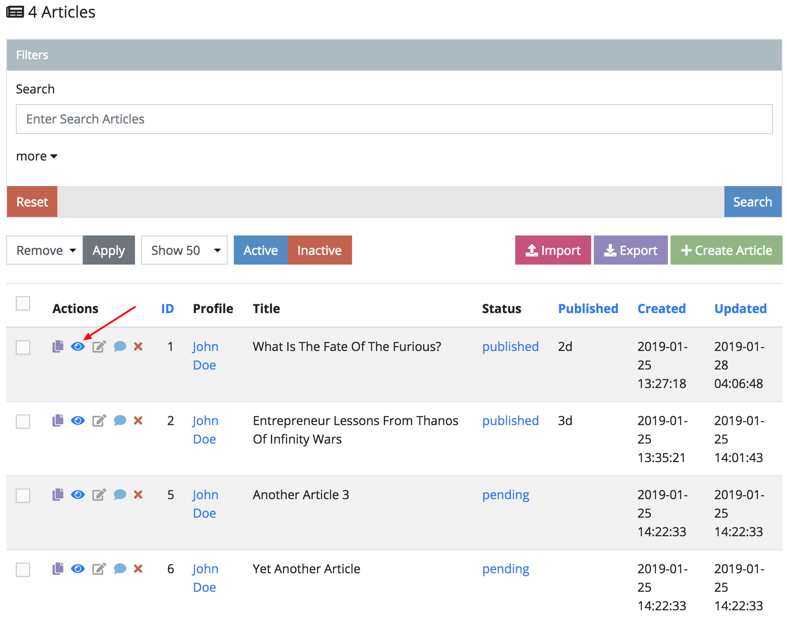

To see a view of this new reference you can click the *blue eye icon* in the
article you just edited. Then click the blue `View` to see a pop up of a subview
table.

###### Figure 2.6.3.F. Navigating to View Reference II
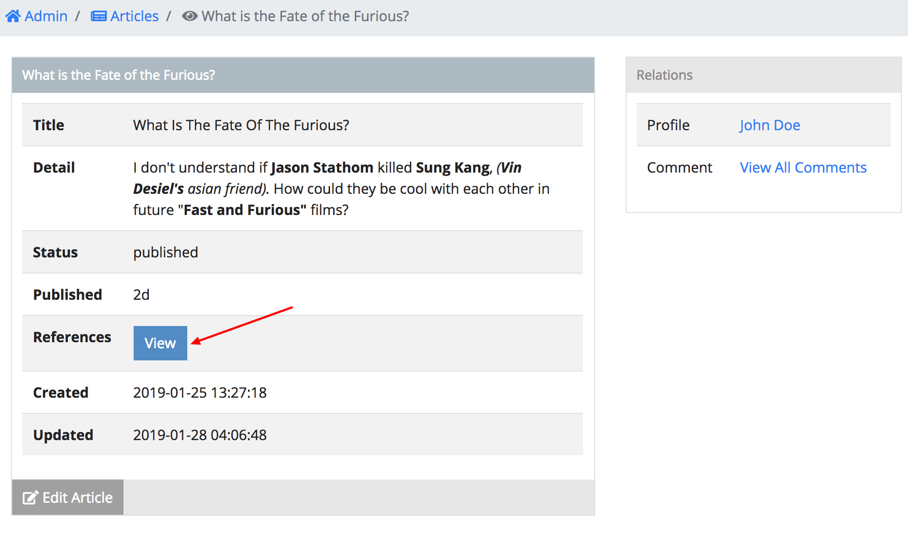

## 2.6.4. Single Fieldset

It is also possible to make a fieldset act similar to a one-to-one *(1:1)*
relationship. Let's say hypothetically we wanted to make sure an **Article**
has one reference.

###### Figure 2.6.4.A. Edit Reference
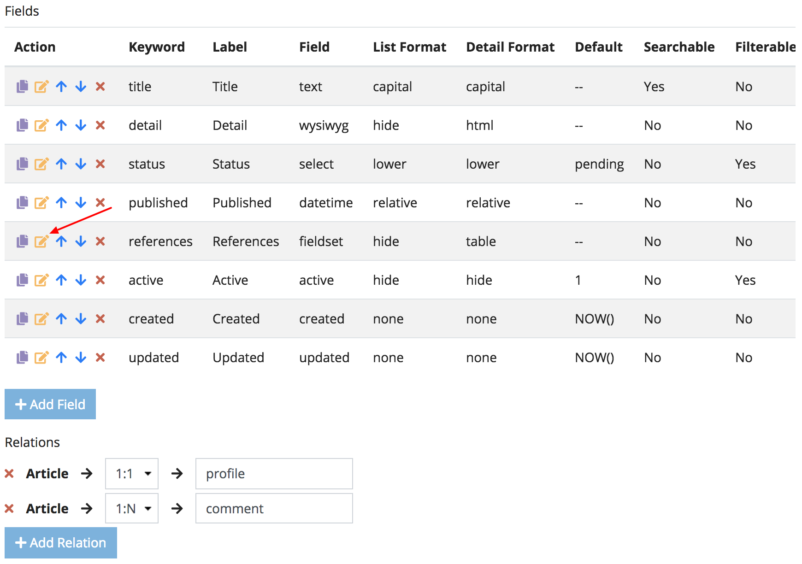

Go to `http://127.0.0.1:8888/admin/system/schema/update/article` once again and
add an attribute called `data-multiple` set to `0` like the image below.

###### Figure 2.6.4.B. data-multiple
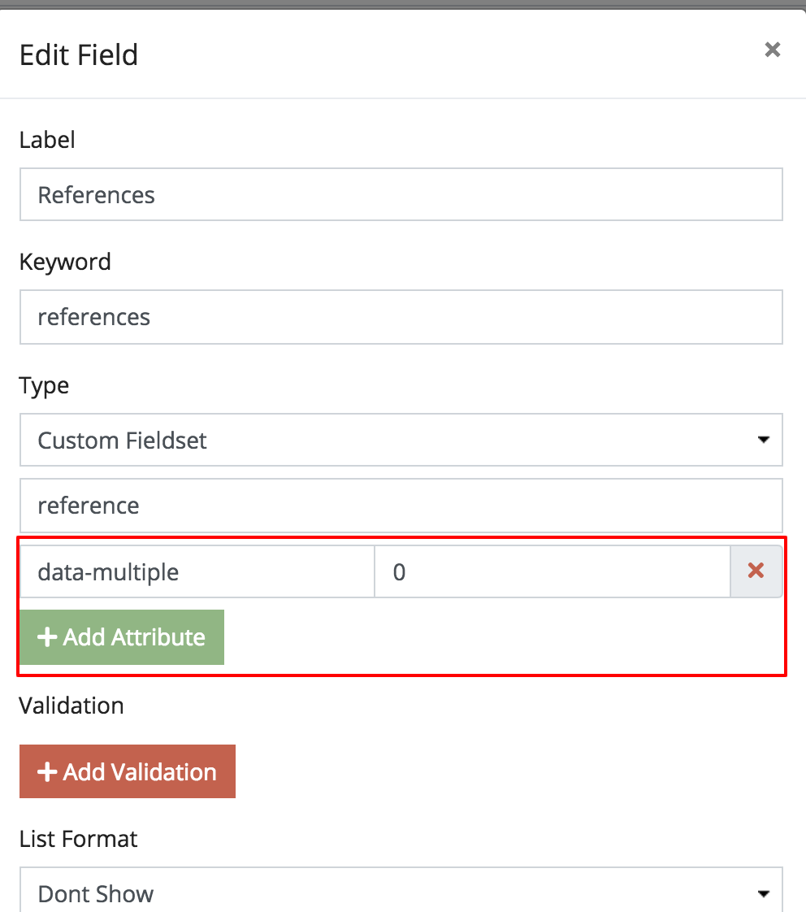

If we resume to go to update an article now, you will notice that the
`Add Reference` button is gone and the fieldset only appears once.

###### Figure 2.6.4.C. Populate Reference
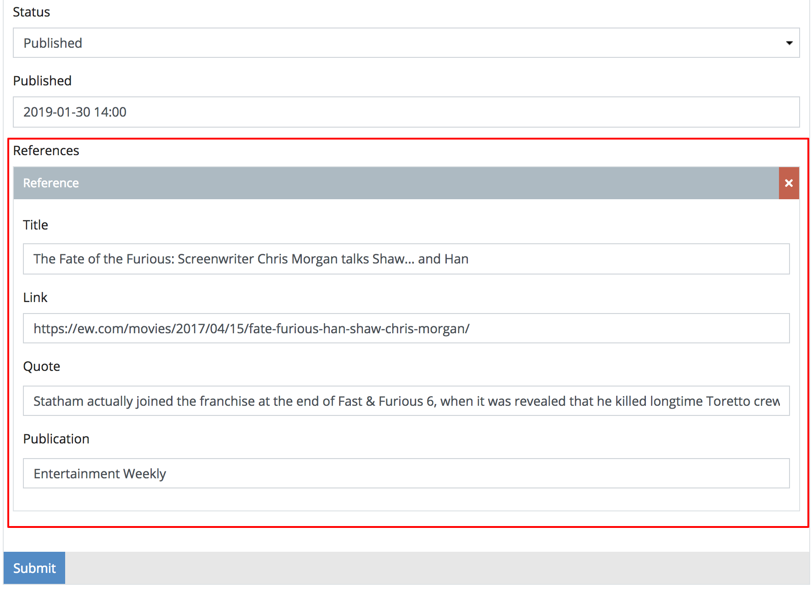

## 2.6.1. Conclusion

Schemas are a type of fieldset thus have similar interfaces. We went over how
to create a fieldset, add a fieldset to an existing object and how different
states of fieldsets are treated in the system. Now that we made enough changes
in the system, let's move on to [2.7. Monitoring Changes](./2.7.-Monitoring-Changes.html)
in order to understand how to monitor changes inside the admin.
