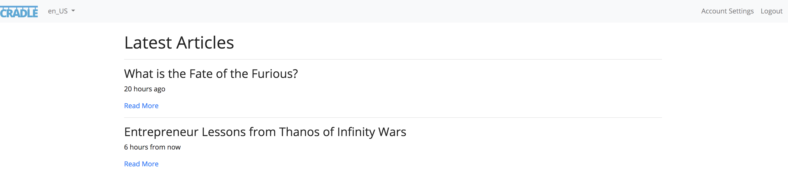
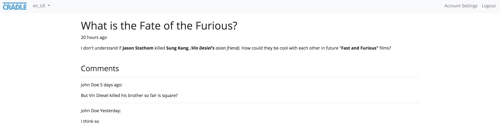

# 4.1. Developing the Front End

 - [4.1.1. Article Search](#search)
 - [4.1.2. Article Detail](#detail)
 - [4.1.3. Adding a Comment](#comment)

This chapter continues from the **2. Working the Admin** section and relies
that you have properly set up the **Article Schema**. If you need a refresher,
make sure you performed the steps needed from the following chapters.

 - [2.1. Creating a Schema](./2.1.-Creating-a-Schema.html)
 - [2.2. Populating Models](./2.2.-Populating-Models.html)
 - [2.3. Working with Relations](./2.3.-Working-With-Relations.html)

So we have an admin great! What we are going to learn in this chapter is how to
programmatically access schemas and models from the code, specifically the front
end. The system has a built in front end package called `/app/www`, in which we
will be primarily working with.

<a name="search"></a>
## 4.1.1. Article Search

The goal of this section is to create a working **Article Search Page**.
Open `/app/www/.cradle.php` and include a new controller called `article.php`
like the following code snippet.

###### Figure 4.1.1.A. Including the Article Controller
```php
/**
 * This file is part of a Custom Project.
 */
include_once __DIR__ . '/src/controller/static.php';
include_once __DIR__ . '/src/controller/article.php';
include_once __DIR__ . '/src/events.php';
...
```

The `.cradle.php` file is primarily used for is including the needed files from
a package's file system *(which is arbitrary)*. Create the **Article Controller**
at `/app/www/src/controller/article.php` and add the following
**Article Search Route**.

###### Figure 4.1.1.B. Adding the Article Search Route
```php
$this->get('/articles', function($req, $res) {
    //get all the articles
    $req->setStage('schema', 'article');
    $this->trigger('system-model-search', $req, $res);

    //set the template variables
    $data = $res->getResults();

    //render the body
    $body = $this->package('/app/www')->template('article/search', $data);

    //Set the page content
    $res
        ->setPage('title', 'Articles')
        ->setContent($body);

    //Render a page
    $this->trigger('www-render-page', $req, $res);
});
```

The purpose of the **Article Search Route** route is to render a page with a
list of **Article Objects**. It does that by first getting the **Article Objects**
from the database, then binding the **Article Objects** data to a body template,
then finally passing the body to the page to be rendered. There are a few of
concepts in the above example that need to be explained.

First, `$this->trigger('system-model-search', $req, $res)` calls a database
search where all you need to do is pass a schema name, in this case `article`.
You can find more about `system-model-search` in
[4.A. Reference: Events](./4.A.-Reference-Events.html#system-model-search).

The [request object](./request.html) has a key called `stage` which holds all the data needed to
process a response. This `stage` data usually has `$_GET` and `$_POST`
automatically populated as well as [route variables](./routing.html#paths). In this case we are
manually adding `schema=article` via `$req->setStage('schema', 'article')`.

Every package can have methods defined on the fly *(or virtual methods)*. Package
methods can be accessed like `$this->package('/app/www')` where `/app/www` is
the name of the package. In the code snippet above, we are calling a package
method called `template()`. The definition of this method can be found at
`/app/www/src/bootstrap/template.php`.

Finally, a package can have events and in the case of the code snippet above it
calls an event named `www-render-page` which will effectively render the rest of
the page given the body. The definition of this event can be found at
`/app/www/src/events.php`.

The next thing to do is create an **Article Search Template** representing the
body of this **Article Search Page**. Create the **Article Search Template** at
`/app/www/src/template/article/search.html` and paste the following HTML.

###### Figure 4.1.1.C. Making the Article Search Template
```html
<div class="container">
    <h1>Latest Articles</h1>
    {{#each rows}}
        <hr />
        <h3>{{article_title}}</h3>
        <p>{{relative article_published}}</p>
        <a href="/article/{{article_id}}">Read More</a>
    {{/each}}
</div>
```

If you noticed, this template file uses a templating engine called
[Handlebars](./4.4.-Intro-to-Handlebars-Templating.html). Handlebars was chosen
for this package because of its availability to use on other programming languages
and even on the client side via JavaScript.

In *Figure 4.1.1.B.* we passed in a variable called `$data` to the body
template. This data becomes accessible to the template engine using template
variables like `{{article_title}}`. In other words, this
means that there is a variable called `article_title` also accessible by
`$data['article_title']`.

On your browser, visit `http://127.0.0.1:8888/articles` to see the
**Article Search Page**.

###### Figure 4.1.1.D. Article Search Page


If you have a few articles you will notice that the order is starting by the
first one created *(rather than latest first)*. We can easily change the order
to what is expected by going back to the **Article Controller**
*(`/app/www/src/controller/article.php`)* and adding a sort on `stage` like the
following code snippet.

###### Figure 4.1.1.E. Ordering Articles
```php
$this->get('/articles', function($req, $res) {
    //get all the articles
    $req
        ->setStage('schema', 'article')
        ->setStage('sort', 'article_published', 'DESC');

    $this->trigger('system-model-search', $req, $res);

    ...
});
```

If you view the **Article Search Page** once again you will see the order has
changed. The template also provided a **Read More** link when clicked goes to a
404 error page. Our next step is to create that detail page.

<a name="detail"></a>
## 4.1.2. Article Detail

Let's go back to the **Article Controller** *(`/app/www/src/controller/article.php`)*
and add the following **Article Detail Route**.

###### Figure 4.1.2.A. Adding the Article Detail Route
```php
...
$this->get('/article/:article_id', function($req, $res) {
    $data = [];

    //get the article
    $req->setStage('schema', 'article');
    $this->trigger('system-model-detail', $req, $res);

    //if there is no data
    if (!$res->hasResults()) {
        //let the 404 catch this
        return;
    }

    //add the article detail
    $data['item'] = $res->getResults();

    //render the body
    $body = $this->package('/app/www')->template('article/detail', $data);

    //Set Content
    $res
        ->setPage('title', $data['item']['article_title'])
        ->setContent($body);

    //Render a page
    $this->trigger('www-render-page', $req, $res);
});
```

While this looks very similar to the article search route, let's additionally
cover the difference. The first is the route path itself defined as
`/article/:article_id` having the `:article_id` route variable. What ever value
the user enters for this will be passed to our request `stage` data.

Last, `$this->trigger('system-model-detail', $req, $res)` calls a database
search where all you need to do is pass a schema name, in this case `article`.
Since the `article_id` is already in stage, there is no need to set it again.
You can find more about `system-model-detail` in
[4.A. Reference: Events](4.A.-Reference-Events.html#system-model-detail).

The next thing to do is create an **Article Detail Template** representing the
body of this page. Create the **Article Detail Template** at
`/app/www/src/template/article/detail.html` and paste the following HTML.

###### Figure 4.1.2.B. Making the Article Detail Template
```html
<div class="container">
    <h1>{{item.article_title}}</h1>
    <p>{{relative item.article_published}}</p>
    {{{item.article_detail}}}

    <h3 class="mt-5">Comments</h3>
    {{#each item.comment}}
        <hr />
        <p>{{profile_name}} {{relative comment_created}}:</p>
        {{{comment_detail}}}
    {{/each}}
</div>
```

On your browser, visit `http://127.0.0.1:8888/article/1` to see the
**Article Detail Page**.

###### Figure 4.1.2.C. Article Detail Page


While this is great, a lot of pages these days have some sort of user interaction
where the base is a form submission. In the next section we will be creating the
ability for a user to comment on an **Article Object**.

<a name="comment"></a>
## 4.1.3. Adding a Comment

In the same **Article Detail Template** *(`/app/www/src/template/article/detail.html`)*,
under the *Comments* section, create a form that looks like the code below.

###### Figure 4.1.3.A. Adding a Comment Form
```html
<div class="container">
    ...

    <h3 class="mt-5">Comments</h3>
    {{#each item.comment}}
        <hr />
        <p>{{profile_name}} {{relative comment_created}}:</p>
        {{{comment_detail}}}
    {{/each}}

    <h4 class="mt-5">Add a Comment</h4>
    <form method="post">
        <div class="form-group{{#if errors.comment_detail}} has-error{{/if}}">
            <textarea class="form-control" name="comment_detail"></textarea>
            {{#if errors.comment_detail}}
                <div class="help-text">{{errors.comment_detail}}</div>
            {{/if}}
        </div>
        <button class="btn btn-primary">Submit</button>
    </form>
</div>
```

In this form it's important to notice a few things. First is that the method of
this form is set to post via `method="post"`. The next thing is that we did not
specify an action path, so by default will use this same page as the action path.

Once we have our template updated, our next step is to process this form. Go back
to the **Article Controller** *(`/app/www/src/controller/article.php`)* and add the
following **POST Article Detail Route** that will process the form submission.

###### Figure 4.1.3.B. Processing a Comment
```php
...
$this->post('/article/:article_id', function($req, $res) {
    //get the article id
    $articleId = $req->getStage('article_id');
    //setup the routing path
    $route = sprintf('/article/%s', $articleId);

    //get the session profile id
    $profileId = $req->getSession('me', 'profile_id');

    if (!$profileId) {
        $res->setError(true, 'Must be logged in to comment.');
        // go back to GET /article/:article_id route
        return $this->routeTo('get', $route, $req, $res);
    }

    //create the comment
    $req
        ->setStage('schema', 'comment')
        ->setStage('profile_id', $profileId);

    $this->trigger('system-model-create', $req, $res);

    //if there was an error creating the comment
    if ($res->isError()) {
        // go back to GET /article/:article_id route
        return $this->routeTo('get', $route, $req, $res);
    }

    //get the comment id
    $commentId = $res->getResults('comment_id');

    //link the article to the comment
    $req
        ->setStage('schema1', 'article')
        ->setStage('schema2', 'comment')
        ->setStage('comment_id', $commentId);

    $this->trigger('system-relation-link', $req, $res);

    //if there was an error linking the article to the comment
    if ($res->isError()) {
        // go back to GET /article/:article_id route
        return $this->routeTo('get', $route, $req, $res);
    }

    //it was good
    //get the global package
    $global = $this->package('global');
    //add a happy message
    $global->flash('Comment Added', 'success');
    //redirect to /article/:article_id
    $global->redirect($route);
});
```

The purpose of the **POST Article Detail Route** is to process the new
**Comment Object** to be created in the database and link the **Comment Object**
to the current **Article Object**. If there is an error at any time, the
**POST Article Detail Route** should re-route to the **Article Detail Route**
where the error will be outputted. If it was successful, it should notify the user
that it was successful and redirect to the **Article Detail Route**. There are
a few of concepts in the above example that need to be explained.

First, `$req->getSession('me');` accesses the current session data
*(the information of whom ever is logged in)*. In this case we just need the
`profile_id` so we fast forward and call `$req->getSession('me', 'profile_id')`
instead. Since all logged in users are assigned a profile, not having a
`profile_id` would mean that this user is actually logged out.

In this **Comment Schema**, we created a one-to-one *(1:1)* relationship with profile. This
means we need to provide a `profile_id` when we create a comment. So this is why
we set the requirement `$res->setError(true, 'Must be logged in to comment.');`.

Next, we create the comment by using `$this->trigger('system-model-create', $req, $res);`.
This first filters and validates the data provided before creating the
**Comment Object** or provides an error message if not. You can find more about
`system-model-create` in [4.A. Reference: Events](4.A.-Reference-Events.html#system-model-create).

```info
INFORMATION system-model-create and system-model-update handle the validation as
defined by your article schema.
```

After the comment is created, the next thing to do is link the **Comment Object**
to the **Article Object**. We can do this by `$this->trigger('system-relation-link', $req, $res);`,
provided that `schema1=article`, `schema2=comment`, and both the `article_id` and
`comment_id` are set in `stage`. You can find more about `system-relation-link` in
[4.A. Reference: Events](4.A.-Reference-Events.html#system-relation-link).

The last thing we need to do since no matter what, the **POST Article Detail Route**
will eventually go to **Article Detail Route**, we need to case for errors in
the **POST Article Detail Route**.

Let's go back to the **Article Controller** *(`/app/www/src/controller/article.php`)*,
find the **POST Article Detail Route** and add the following code snippet inside.

###### Figure 4.1.3.C. Casing for Form Results
```php
...
$this->get('/article/:article_id', function($req, $res) {
    $data = [];
    //if this is a return back from processing the comment form
    if ($req->hasPost()) {
        $data['form'] = $res->getPost();
    }

    //and it's has of an error
    if ($res->isError()) {
        //pass the error messages to the template
        $res->setFlash($res->getMessage(), 'error');
        $data['errors'] = $res->getValidation();
    }

    ...
});
```

On your browser, visit `http://127.0.0.1:8888/article/detail/1` to see your full
page with form submission working.

<a name="conclusion"></a>
## 4.1.4. Conclusion

We worked with articles in the front end using the `/app/www` package. In our
next chapter [4.2. Writing a Package](./4.2.-Writing-a-Package.html),
we will work through creating a package from scratch.
